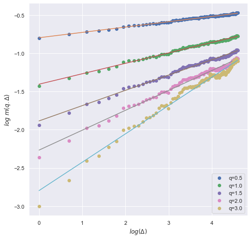
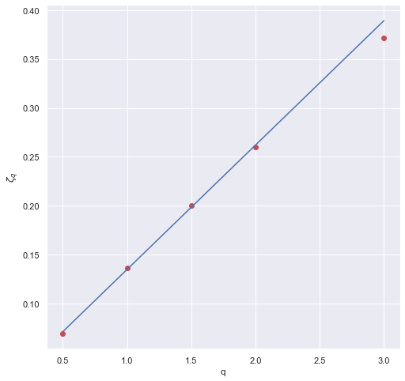
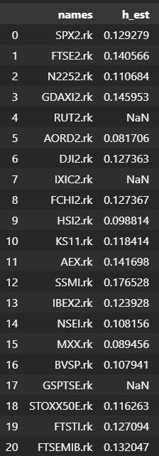
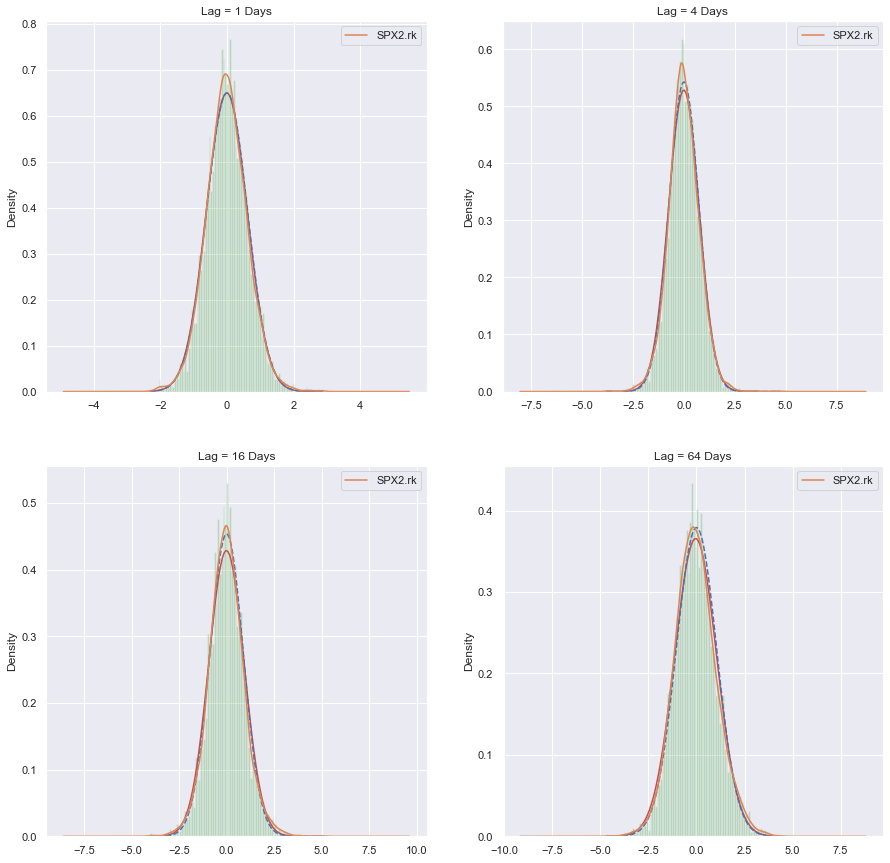
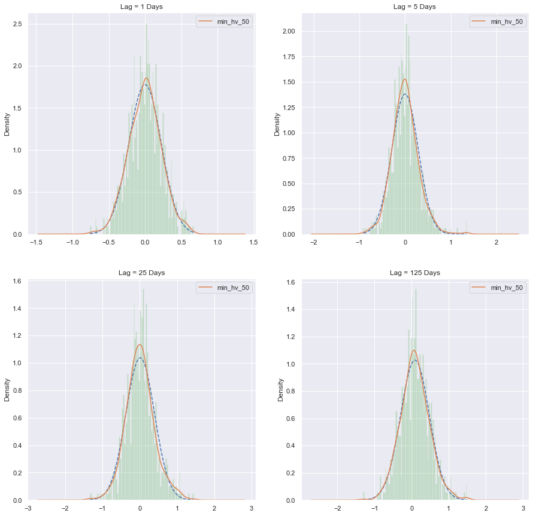
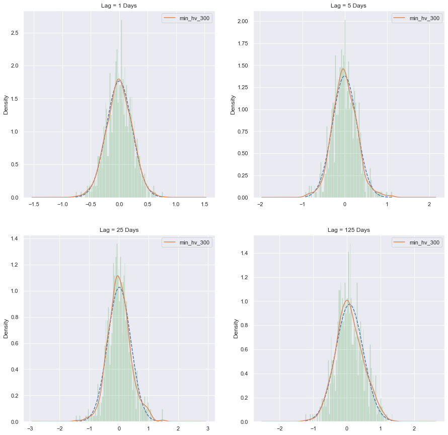

# 粗糙波动率

## 随机波动率模型

金融中通常将标的的价格建模为下述方程, $\mu$ 和 $\sigma$ 是两个常数,
$$
d S_{t}=\mu S_{t} d t+\sigma S_{t} d W_{t}
$$
随机波动率模型是将 $\sigma$ 也建模成一个随机过程, 最简单的情形为:
$$
\begin{aligned}
d S_{t} &=\mu S_{t} d t+\sqrt{\nu_{t}} S_{t} d W_{t} \\
d \nu_{t} &=\alpha_{\nu, t} d t+\beta_{\nu, t} d B_{t}
\end{aligned}
$$

## 原文做法

原文：[Volatility is Rough](https://www.tandfonline.com/doi/full/10.1080/14697688.2017.1393551), Jim Gatheral, 2016.

Jim Gatheral等人对全球范围内21只股指做了研究, 包括SPX,FTSE,N225,GDAXI,RUT,AORD,DJI,IXIC,FCHI,HSI,KS11,AEX,SSMI,IBEX,NSEI,MXX,BVSR,GSPTSE,STOXX50E,FTST,FTSEMIB, 采用的数据是[http://realized.oxfordman.ox.ac.uk](http://realized.oxfordman.ox.ac.uk)上提供的根据高频数据计算的每日已实现波动率, 数据时间范围从2000年到2017年. 他们提出标的的**对数波动率的增量**满足如下规律
$$
\log \sigma_{t+\Delta}-\log \sigma_{t}=\nu\left(W_{t+\Delta}^{H}-W_{t}^{H}\right)\tag{1}
$$

为此, 他们研究的是
$$
m(q, \Delta)=\left\langle\left|\log \sigma_{t+\Delta}-\log \sigma_{t}\right|^{q}\right\rangle,
$$
其中, $\Delta$是已实现波动率的时间间隔, $\Delta=1$ 即为相邻的两天. 他比较了 $q=0.5, 1, 1.5, 2, 3, \Delta=0,\cdots,100$, 然后比较了 $m(q,\Delta) 和 \Delta$ 的关系, 以**标普500**为例, 结果满足下图

所以, 对每个 $q, m(q, \Delta) \propto \Delta^{\zeta q}$. 然后寻找 $\zeta_q和q的关系$, 直接根据拟合得到的 $\zeta_q$ 和 $q$ 作个图, 

也就是直接就是正比关系, 
$$
\zeta_{q}=q H
$$
斜率 $H \approx 0.13$. 然后对全部21只股指都类似做法, 得到

然后是不同 $\Delta$ 下对数波动率增量 $\left(\log \sigma_{t+\Delta}-\log \sigma_{t}\right)$ 的分布,

##50etf与300etf

下面对ETF50, ETF300 做类似分析, 数据采用2022.7.11过去三年的1分钟级数据, 去除收盘前五分钟数据后计算每天的分钟级hv.

**对数波动率的增量与时间间隔的关系**

**上述拟合的一次函数斜率和q之间的关系**

**对数波动率增量的分布**

50etf

300etf

检验正态分布采用 python 中 scipy.stats 中的 ks 检验函数, 50以及300的检验结果分别为

- 50etf中:间隔为**4,6,10,16,19,20,35,36,38,39**时不是正态分布
- 300etf中:间隔为**3,6,10,35,38**时不是正态分布
