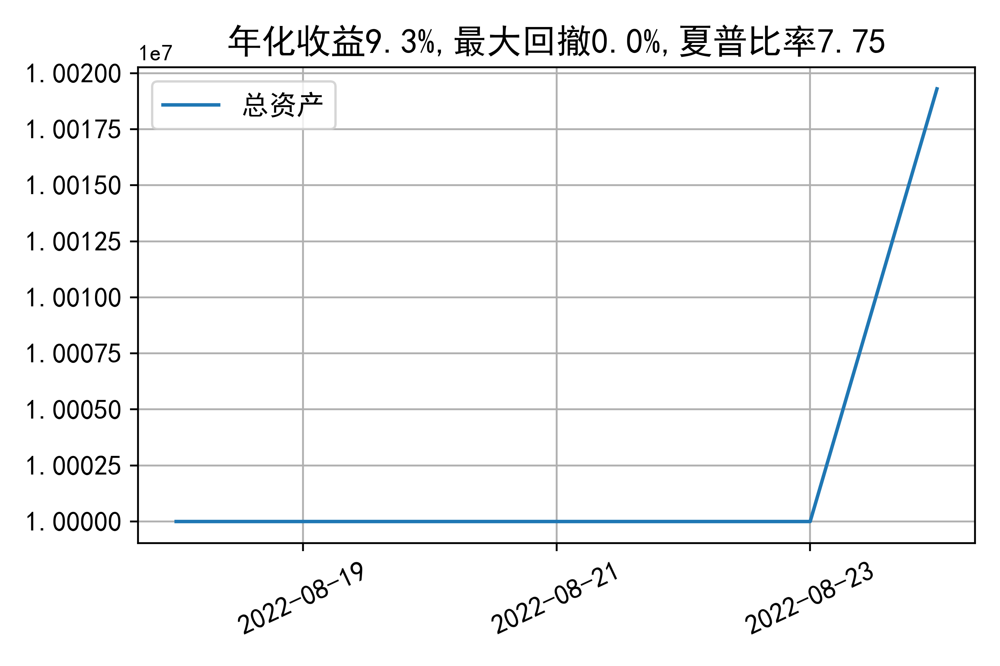

# 日级别vanna模拟交易2022-08-24概览
## 今日损益
|            | 模拟账户损益统计   |
|:-----------|:-------------------|
| 模拟账户名 | 1999_2-0070889     |
| 日期       | 2022-08-24         |
| 市值权益   | 10019298           |
| 今日收益   | 0.22%              |
| 今日损益   | 21878              |
| 昨持损益   | 0                  |
| 日内损益   | 21878              |
| 手续费     | 2580               |
| 总持仓     | 1909               |
| 净持仓     | -189               |

## 持仓统计
**最终持仓统计**

|            | 2.7   | 2.75   | 2.8   |   2.85 | 2.9   |
|:-----------|:------|:-------|:------|-------:|:------|
| 202209call | -     | 215    | -     |    -64 | -645  |
| 202209put  | 645   | -      | -125  |   -215 | -     |

**日内持仓变化**

|            | 2.7   | 2.75   | 2.8   |   2.85 | 2.9   |
|:-----------|:------|:-------|:------|-------:|:------|
| 202209call | -     | 215    | -     |    -64 | -645  |
| 202209put  | 645   | -      | -125  |   -215 | -     |

## cashgreeks统计

**总体cashgreeks**
|        | \$Delta   | \$Gamma   | \$Vega   | \$Vanna   | \$Theta   | \$Charm   | \$Speed    | \$Vomma   |
|:-------|:----------|:----------|:---------|:----------|:----------|:----------|:-----------|:----------|
| 202209 | -148403   | 2603369   | 2038     | -523869   | -1001     | 44629367  | -421497212 | -895      |
| 总计   | -148403   | 2603369   | 2038     | -523869   | -1001     | 44629367  | -421497212 | -895      |

**日内cashgreeks**

|        | \$Delta   | \$Gamma   | \$Vega   | \$Vanna   | \$Theta   | \$Charm   | \$Speed    | \$Vomma   |
|:-------|:----------|:----------|:---------|:----------|:----------|:----------|:-----------|:----------|
| 202209 | -148403   | 2603369   | 2038     | -523869   | -1001     | 44629367  | -421497212 | -895      |
| 总计   | -148403   | 2603369   | 2038     | -523869   | -1001     | 44629367  | -421497212 | -895      |

## 总资产曲线图

