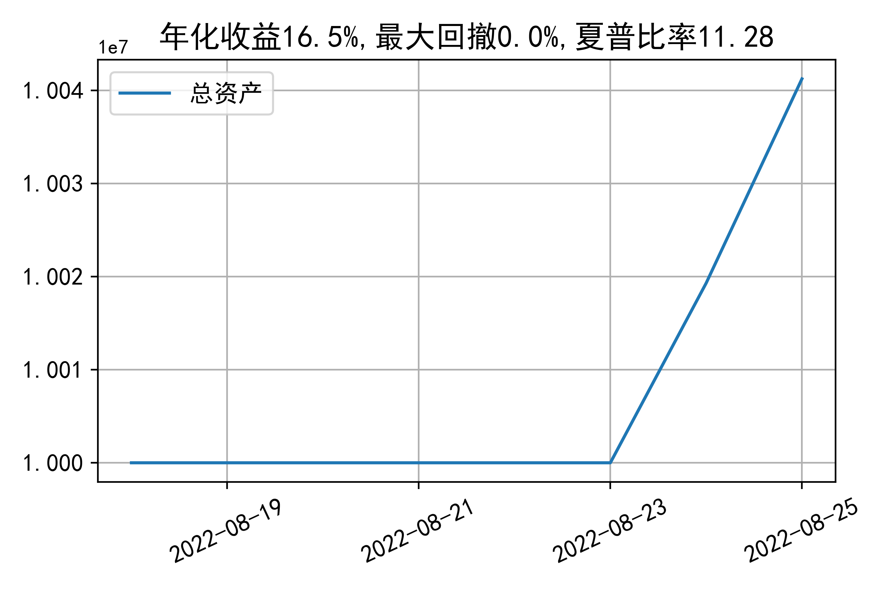

# 日级别vanna模拟交易2022-08-25概览
## 今日损益
|            | 模拟账户损益统计   |
|:-----------|:-------------------|
| 模拟账户名 | 1999_2-0070889     |
| 日期       | 2022-08-25         |
| 市值权益   | 10041241           |
| 今日收益   | 0.26%              |
| 今日损益   | 25675              |
| 昨持损益   | 18968              |
| 日内损益   | 6707               |
| 手续费     | 3732               |
| 总持仓     | 3897               |
| 净持仓     | 311                |

## 持仓统计
**最终持仓统计**

|            | 2.65   |   2.7 | 2.75   | 2.8   |   2.85 | 2.9   |
|:-----------|:-------|------:|:-------|:------|-------:|:------|
| 202209call | -      |   186 | 368    | -     |   -622 | -645  |
| 202209put  | 764    |   786 | -      | -125  |   -401 | -     |

**日内持仓变化**

|            | 2.65   |   2.7 | 2.75   | 2.8   |   2.85 |
|:-----------|:-------|------:|:-------|:------|-------:|
| 202209call | -      |   186 | 153    | -     |   -558 |
| 202209put  | 764    |   141 | -      | -     |   -186 |

## cashgreeks统计

**总体cashgreeks**
|        | \$Delta   | \$Gamma   | \$Vega   | \$Vanna   | \$Theta   | \$Charm   | \$Speed   | \$Vomma   |
|:-------|:----------|:----------|:---------|:----------|:----------|:----------|:----------|:----------|
| 202209 | 145950    | -15505954 | -2332    | -1204990  | -979      | 105863620 | 875449586 | 849       |
| 总计   | 145950    | -15505954 | -2332    | -1204990  | -979      | 105863620 | 875449586 | 849       |

**日内cashgreeks**

|        | \$Delta   | \$Gamma   | \$Vega   | \$Vanna   | \$Theta   | \$Charm   | \$Speed    | \$Vomma   |
|:-------|:----------|:----------|:---------|:----------|:----------|:----------|:-----------|:----------|
| 202209 | 40644     | 4749606   | 4890     | -601206   | -2839     | 54193641  | -480429883 | 939       |
| 总计   | 40644     | 4749606   | 4890     | -601206   | -2839     | 54193641  | -480429883 | 939       |

## 总资产曲线图

