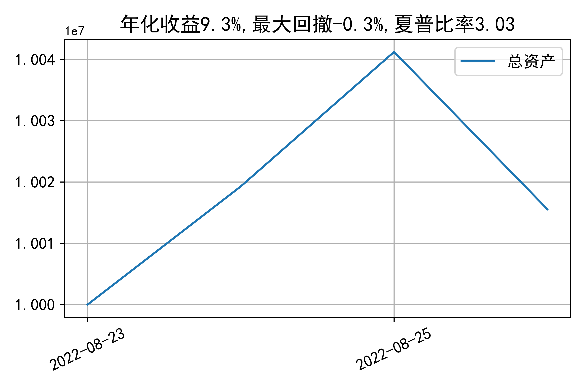

# 日级别vanna模拟交易2022-08-26概览
## 今日损益
|            | 模拟账户损益统计   |
|:-----------|:-------------------|
| 模拟账户名 | 1999_2-0070889     |
| 日期       | 2022-08-26         |
| 市值权益   | 10015569           |
| 今日收益   | -0.26%             |
| 今日损益   | -26422             |
| 昨持损益   | -24994             |
| 日内损益   | -1428              |
| 手续费     | 387                |
| 总持仓     | 4026               |
| 净持仓     | 440                |

## 持仓统计
**最终持仓统计**

|            | 2.65 | 2.7  | 2.75 | 2.8  | 2.85 | 2.9  |
| :--------- | :--: | :--: | :--: | :--: | :--: | :--: |
| 202209call |  -   | 186  | 368  |  -   | -622 | -645 |
| 202209put  | 764  | 915  |  -   | -125 | -401 |  -   |

**日内持仓变化**

|            | 2.7   |
|:-----------|:------|
| 202209call | -     |
| 202209put  | 129   |

## cashgreeks统计

**总体cashgreeks**
|        | \$Delta   | \$Gamma   | \$Vega   | \$Vanna   | \$Theta   | \$Charm   | \$Speed   | \$Vomma   |
|:-------|:----------|:----------|:---------|:----------|:----------|:----------|:----------|:----------|
| 202209 | 653719    | -9972356  | -1071    | -1336399  | -937      | 117848345 | 678500498 | 1139      |
| 总计   | 653719    | -9972356  | -1071    | -1336399  | -937      | 117848345 | 678500498 | 1139      |

**日内cashgreeks**

|        | \$Delta   | \$Gamma   | \$Vega   | \$Vanna   | \$Theta   | \$Charm   | \$Speed   | \$Vomma   |
|:-------|:----------|:----------|:---------|:----------|:----------|:----------|:----------|:----------|
| 202209 | -785697   | 7770599   | 3225     | -48067    | -1178     | 4280136   | -47279185 | 113       |
| 总计   | -785697   | 7770599   | 3225     | -48067    | -1178     | 4280136   | -47279185 | 113       |

## 总资产曲线图

