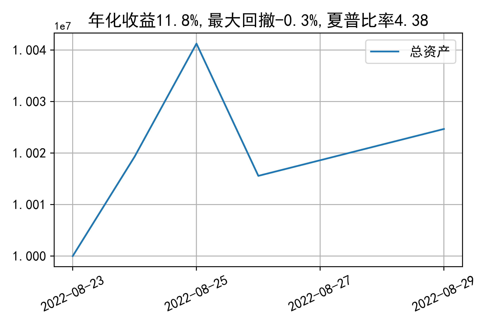

# 日级别vanna模拟交易2022-08-29概览
## 今日损益
|            | 模拟账户损益统计   |
|:-----------|:-------------------|
| 模拟账户名 | 1999_2-0070889     |
| 日期       | 2022-08-29         |
| 市值权益   | 10024669           |
| 今日收益   | 0.097%             |
| 今日损益   | 9688               |
| 昨持损益   | 7034               |
| 日内损益   | 2654               |
| 手续费     | 0                  |
| 总持仓     | 4415               |
| 净持仓     | 51                 |

## 持仓统计
**最终持仓统计**

|            | 2.65 | 2.7  | 2.75 | 2.8  | 2.85 | 2.9  |
| :--------- | :--: | :--: | :--: | :--: | :--: | :--: |
| 202209call |  -   | 186  | 368  |  -   | -905 | -645 |
| 202209put  | 764  | 915  |  -   | -125 | -507 |  -   |

**日内持仓变化**

|            | 2.65 | 2.7  | 2.75 | 2.8  | 2.85 | 2.9  |
| :--------- | :--: | :--: | :--: | :--: | :--: | :--: |
| 202209call |  -   |  -   |  -   |  -   | -283 |  -   |
| 202209put  |  -   |  -   |  -   |  -   | -106 |  -   |

## cashgreeks统计

**总体cashgreeks**
|        | \$Delta   | \$Gamma   | \$Vega   | \$Vanna   | \$Theta   | \$Charm   | \$Speed   | \$Vomma   |
|:-------|:----------|:----------|:---------|:----------|:----------|:----------|:----------|:----------|
| 202209 | 122373    | -11853842 | -179     | -1452169  | -1222     | 137071709 | 491393306 | -118      |
| 总计   | 122373    | -11853842 | -179     | -1452169  | -1222     | 137071709 | 491393306 | -118      |

**日内cashgreeks**

|        | \$Delta   | \$Gamma   | \$Vega   | \$Vanna   | \$Theta   | \$Charm   | \$Speed    | \$Vomma   |
|:-------|:----------|:----------|:---------|:----------|:----------|:----------|:-----------|:----------|
| 202209 | -301644   | -29187928 | -10892   | -136087   | 4151      | 12341879  | -111294179 | -209      |
| 总计   | -301644   | -29187928 | -10892   | -136087   | 4151      | 12341879  | -111294179 | -209      |

## 总资产曲线图

