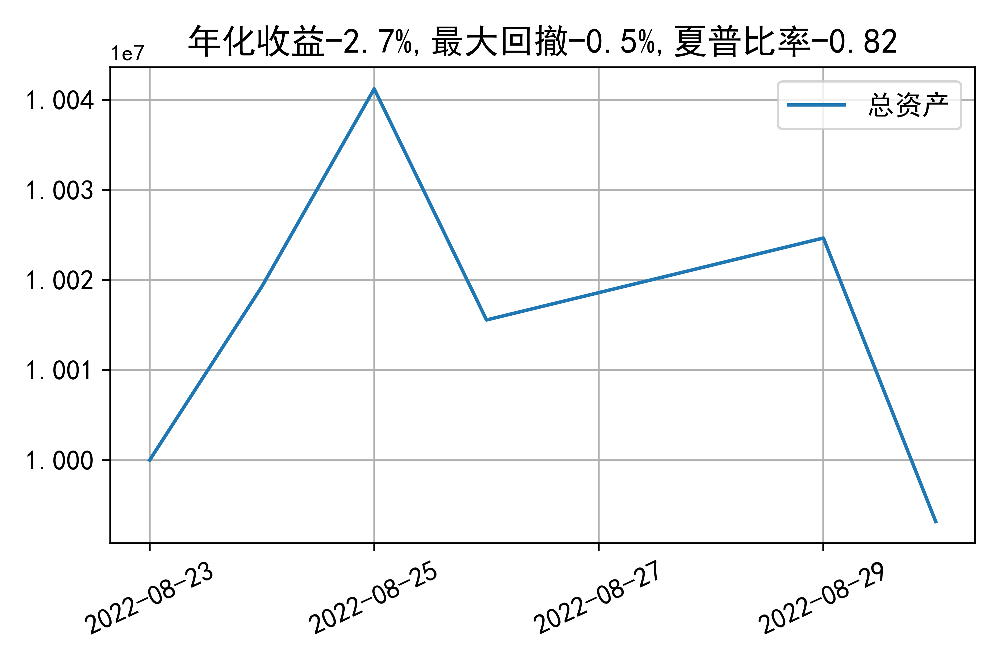

# 日级别vanna模拟交易2022-08-30概览
## 今日损益
|            | 模拟账户损益统计   |
|:-----------|:-------------------|
| 模拟账户名 | 1999_2-0070889     |
| 日期       | 2022-08-30         |
| 市值权益   | 9993177            |
| 今日收益   | -0.314%            |
| 今日损益   | -31492             |
| 昨持损益   | -31102             |
| 日内损益   | -390               |
| 手续费     | 0                  |
| 总持仓     | 4493               |
| 净持仓     | -27                |

## 持仓统计
**最终持仓统计**

|            | 2.65 | 2.7  | 2.75 | 2.8  | 2.85 | 2.9  |
| :--------- | :--: | :--: | :--: | :--: | :--: | :--: |
| 202209call |  -   | 186  | 368  |  -   | -983 | -645 |
| 202209put  | 764  | 915  |  -   | -125 | -507 |  -   |

**日内持仓变化**

|            | 2.65 | 2.7  | 2.75 | 2.8  | 2.85 | 2.9  |
| :--------- | :--: | :--: | :--: | :--: | :--: | :--: |
| 202209call |  -   |  -   |  -   |  -   | -78  |  -   |
| 202209put  |  -   |  -   |  -   |  -   |  -   |  -   |

## cashgreeks统计

**总体cashgreeks**
|        | \$Delta   | \$Gamma   | \$Vega   | \$Vanna   | \$Theta   | \$Charm   | \$Speed   | \$Vomma   |
|:-------|:----------|:----------|:---------|:----------|:----------|:----------|:----------|:----------|
| 202209 | 508604    | -8361484  | -590     | -1528220  | -609      | 149037228 | 328555021 | -321      |
| 总计   | 508604    | -8361484  | -590     | -1528220  | -609      | 149037228 | 328555021 | -321      |

**日内cashgreeks**

|        | \$Delta   | \$Gamma   | \$Vega   | \$Vanna   | \$Theta   | \$Charm   | \$Speed   | \$Vomma   |
|:-------|:----------|:----------|:---------|:----------|:----------|:----------|:----------|:----------|
| 202209 | -609626   | -5809622  | -2106    | -28850    | 827       | 2752621   | -25118857 | -47       |
| 总计   | -609626   | -5809622  | -2106    | -28850    | 827       | 2752621   | -25118857 | -47       |

## 总资产曲线图

