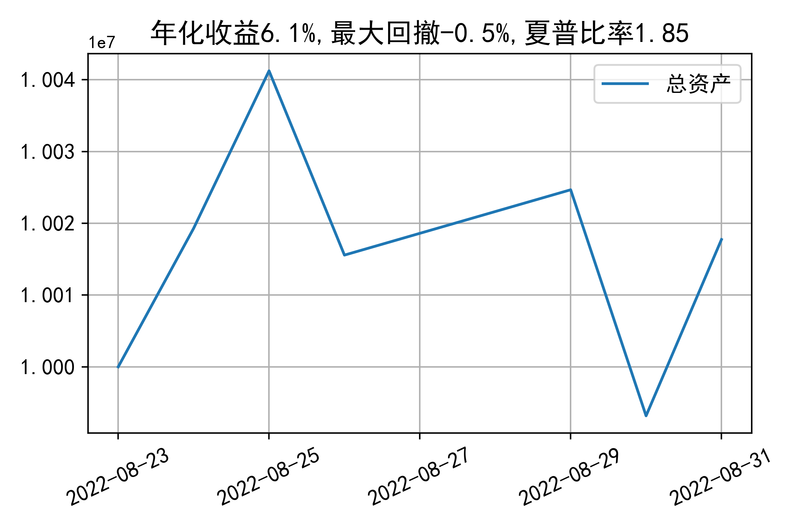

# 日级别vanna模拟交易2022-08-31概览
## 今日损益
|            | 模拟账户损益统计   |
|:-----------|:-------------------|
| 模拟账户名 | 1999_2-0070889     |
| 日期       | 2022-08-31         |
| 市值权益   | 10017738           |
| 今日收益   | 0.279%             |
| 今日损益   | 27834              |
| 昨持损益   | 24609              |
| 日内损益   | 3225               |
| 手续费     | 1629               |
| 总持仓     | 5036               |
| 净持仓     | 516                |

## 持仓统计
**最终持仓统计**

|            | 2.65 | 2.7  | 2.75 | 2.8  | 2.85 | 2.9  |
| :--------- | :--: | :--: | :--: | :--: | :--: | :--: |
| 202209call |  -   | 186  | 515  |  -   | -983 | -645 |
| 202209put  | 764  | 1311 |  -   | -125 | -507 |  -   |

**日内持仓变化**

|            | 2.65 | 2.7  | 2.75 | 2.8  | 2.85 | 2.9  |
| :--------- | :--: | :--: | :--: | :--: | :--: | :--: |
| 202209call |  -   |  -   | 147  |  -   |  -   |  -   |
| 202209put  |  -   | 396  |  -   |  -   |  -   |  -   |

## cashgreeks统计

**总体cashgreeks**
|        | \$Delta   | \$Gamma   | \$Vega   | \$Vanna   | \$Theta   | \$Charm   | \$Speed   | \$Vomma   |
|:-------|:----------|:----------|:---------|:----------|:----------|:----------|:----------|:----------|
| 202209 | -298613   | -24100244 | -5122    | -1556620  | 560       | 166506927 | 344888099 | 1553      |
| 总计   | -298613   | -24100244 | -5122    | -1556620  | 560       | 166506927 | 344888099 | 1553      |

**日内cashgreeks**

|        | \$Delta   | \$Gamma   | \$Vega   | \$Vanna   | \$Theta   | \$Charm   | \$Speed    | \$Vomma   |
|:-------|:----------|:----------|:---------|:----------|:----------|:----------|:-----------|:----------|
| 202209 | 604186    | 34540826  | 12828    | -183610   | -5686     | 19793182  | -202051139 | 394       |
| 总计   | 604186    | 34540826  | 12828    | -183610   | -5686     | 19793182  | -202051139 | 394       |

## 总资产曲线图

