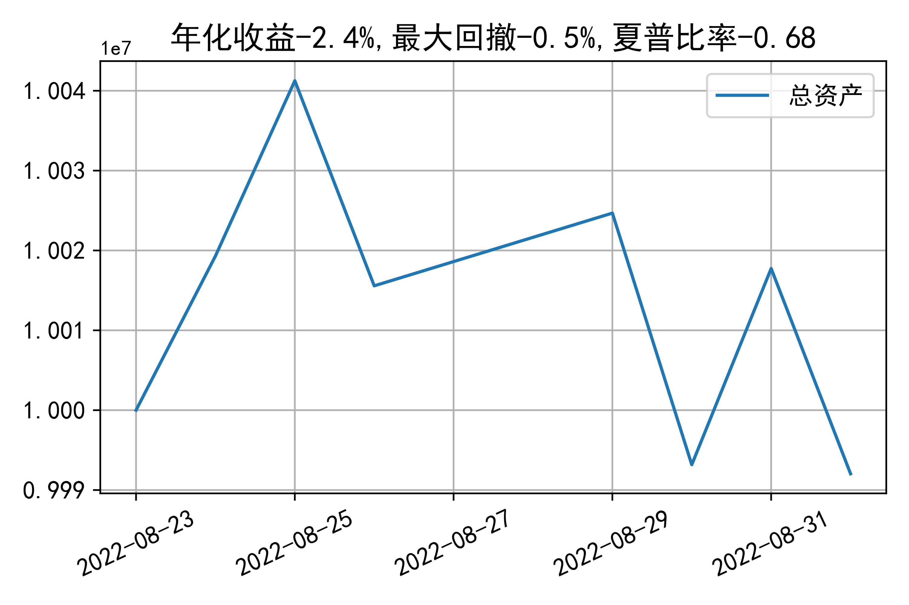

# 日级别vanna模拟交易2022-09-01概览
## 今日损益

|            | 模拟账户损益统计 |
| :--------- | :--------------- |
| 模拟账户名 | 1999_2-0070889   |
| 日期       | 2022-09-01       |
| 市值权益   | 9992046          |
| 今日收益   | -0.256%          |
| 今日损益   | -25692           |
| 手续费     | 15108            |
| 总持仓     | 0                |
| 净持仓     | 0                |

## 持仓统计
**今日最终未持仓**

**日内持仓变化**

|            | 2.6  | 2.65 |  2.7  | 2.75 | 2.8  | 2.85 | 2.9  |
| :--------- | :--: | :--: | :---: | :--: | :--: | :--: | :--: |
| 202209call |  0   |  -   | -186  | -515 |  -   | 983  | 645  |
| 202209put  |  0   | -764 | -1311 |  -   | 125  | 507  |  -   |

## cashgreeks统计

**总体cashgreeks**
|        | \$Delta   | \$Gamma   | \$Vega   | \$Vanna   | \$Theta   | \$Charm   | \$Speed   | \$Vomma   |
|:-------|:----------|:----------|:---------|:----------|:----------|:----------|:----------|:----------|
| 202209 | 0         | 0         | 0        | 0         | 0         | 0         | 0         | 0         |
| 总计   | 0         | 0         | 0        | 0         | 0         | 0         | 0         | 0         |

**日内cashgreeks**

|        | \$Delta | \$Gamma   | \$Vega | \$Vanna | \$Theta | \$Charm | \$Speed    | \$Vomma |
| :----- | :------ | :-------- | :----- | :------ | :------ | :------ | :--------- | :------ |
| 202209 | -149872 | -20677538 | -9472  | 1608832 | 5582    | -757172 | -173251249 | -266    |
| 总计   | -149872 | -20677538 | -9472  | 1608832 | 5582    | -757172 | -173251249 | -266    |

## 总资产曲线图

