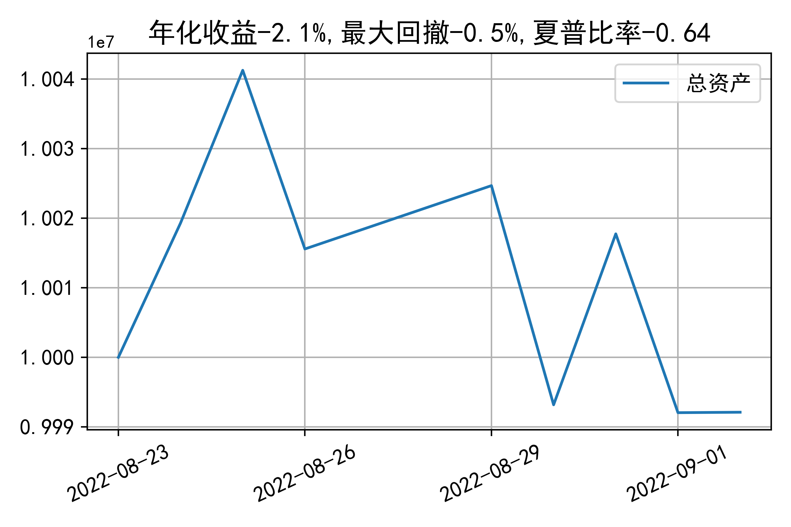

# 日级别vanna模拟交易2022-09-02概览
## 今日损益
|            | 模拟账户损益统计   |
|:-----------|:-------------------|
| 模拟账户名 | 1999_2-0070889     |
| 日期       | 2022-09-02         |
| 市值权益   | 9992109            |
| 今日收益   | -0.146%            |
| 今日损益   | -14570             |
| 昨持损益   | 0                  |
| 日内损益   | -14570             |
| 手续费     | 2700               |
| 总持仓     | 0                  |
| 净持仓     | 0                  |

## 持仓统计
**今日最终未持仓**

**日内持仓变化**

|            | 2.6   | 2.65   | 2.7   | 2.75   |
|:-----------|:------|:-------|:------|:-------|
| 202209call | 0     | -      | -     | 0      |
| 202209put  | -     | -      | -     | -      |

## cashgreeks统计

**总体cashgreeks**
|        | \$Delta   | \$Gamma   | \$Vega   | \$Vanna   | \$Theta   | \$Charm   | \$Speed   | \$Vomma   |
|:-------|:----------|:----------|:---------|:----------|:----------|:----------|:----------|:----------|
| 202209 | 0         | 0         | 0        | 0         | 0         | 0         | 0         | 0         |
| 总计   | 0         | 0         | 0        | 0         | 0         | 0         | 0         | 0         |

**日内cashgreeks**

|        | \$Delta   | \$Gamma   | \$Vega   | \$Vanna   | \$Theta   | \$Charm   | \$Speed   | \$Vomma   |
|:-------|:----------|:----------|:---------|:----------|:----------|:----------|:----------|:----------|
| 202209 | 0         | 0         | 0        | 0         | 0         | 0         | 0         | 0         |
| 总计   | 0         | 0         | 0        | 0         | 0         | 0         | 0         | 0         |

## 总资产曲线图

