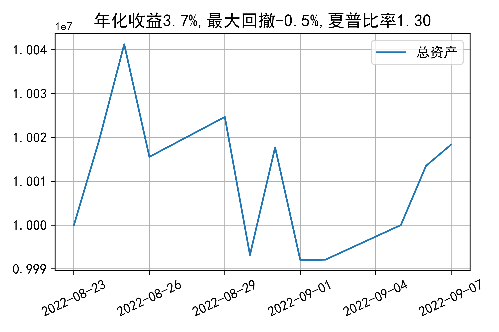

# 日级别vanna模拟交易2022-09-07概览
## 今日损益
|            | 模拟账户损益统计   |
|:-----------:|:-------------------:|
| 模拟账户名 | 1999_2-0070889     |
| 日期       | 2022-09-07         |
| 市值权益   | 10018377           |
| 今日收益   | 0.066%             |
| 今日损益   | 6590               |
| 昨持损益   | 6590(0.07%)        |
| 日内损益   | 0(0.0%)            |
| 手续费     | 0(0.0%)            |
| 总持仓     | 3539               |
| 净持仓     | 445                |

## 持仓统计
**最终持仓统计**

|            |   2.65 | 2.7   | 2.75   |   2.8 | 2.85   |
|:-----------:|:-------:|:------:|:-------:|:------:|:-------:|
| 202209call |    156 | 353   | -      |  -399 | -816   |
| 202209put  |   1483 | -     | -      |  -332 | -      |

**今日日内未交易**

## cashgreeks统计

**总体cashgreeks**
|        | \$Delta   | \$Gamma   | \$Vega   | \$Vanna   | \$Theta   | \$Charm   | \$Speed   | \$Vomma   |
|:-------:|:----------:|:----------:|:---------:|:----------:|:----------:|:----------:|:----------:|:----------:|
| 202209 | 535875    | -5968681  | 2203     | -1189379  | -3350     | 177647932 | 277804359 | 625       |
| 总计   | 535875    | -5968681  | 2203     | -1189379  | -3350     | 177647932 | 277804359 | 625       |

**日内cashgreeks**

|        | \$Delta   | \$Gamma   | \$Vega   | \$Vanna   | \$Theta   | \$Charm   | \$Speed   | \$Vomma   |
|:-------:|:----------:|:----------:|:---------:|:----------:|:----------:|:----------:|:----------:|:----------:|
| 202209 | 0         | 0         | 0        | 0         | 0         | 0         | 0         | 0         |
| 总计   | 0         | 0         | 0        | 0         | 0         | 0         | 0         | 0         |

## 总资产曲线图

