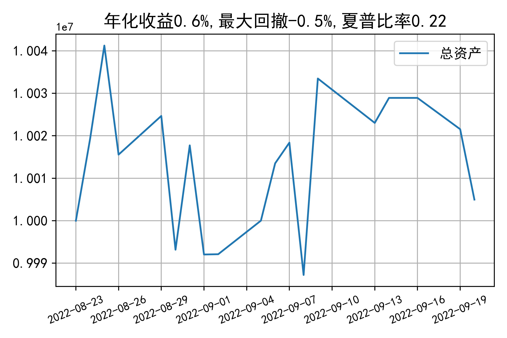

# 日级别vanna模拟交易2022-09-20概览
## 今日损益
|                    | 模拟账户损益统计   |
|:-------------------:|:-------------------:|
| 模拟账户名         | 1999_2-0070889     |
| 日期               | 2022-09-20         |
| 市值权益           | 10004975           |
| 今日损益(含手续费) | -18473 (-0.185%)   |
| 昨持损益           | -17422 (-0.174%)   |
| 日内损益           | -565 (-0.006%)     |
| 手续费             | 486 (0.005%)       |
| 总持仓             | 2944               |
| 净持仓             | -160               |
| 本月总计收益       | -25846             |
| 本月总计日内       | -2820              |
| 本月总计手续费     | 5604               |

## 持仓统计
**最终持仓统计**

|            | 2.65   | 2.7   | 2.75   | 2.8   |
|:-----------:|:-------:|:------:|:-------:|:------:|
| 202209call | -      | 207   | -      | -1203 |
| 202209put  | 1185   | -     | -349   | -     |

**日内持仓变化**

|            | 2.65   | 2.7   | 2.75   | 2.8   |
|:-----------:|:-------:|:------:|:-------:|:------:|
| 202209call | -      | -144  | -      | -     |
| 202209put  | -18    | -     | -      | -     |

## cashgreeks统计

**总体cashgreeks**
|        | \$Delta      | \$Gamma   | \$Vega      | \$Vanna          | \$Theta   | \$Charm   | \$Speed    | \$Vomma   |
|:-------:|:-------------:|:----------:|:------------:|:-----------------:|:----------:|:----------:|:-----------:|:----------:|
| 202209 | 205446       | -4984072  | 285         | -1065628         | -768      | 357069833 | -489320275 | -247      |
| 总计   | 205446(2.1%) | -4984072  | 285(0.003%) | -1065628(-10.7%) | -768      | 357069833 | -489320275 | -247      |

**日内cashgreeks**

|        | \$Delta   | \$Gamma   | \$Vega   | \$Vanna   | \$Theta   | \$Charm   | \$Speed   | \$Vomma   |
|:-------:|:----------:|:----------:|:---------:|:----------:|:----------:|:----------:|:----------:|:----------:|
| 202209 | -2288007  | -23236358 | -2502    | 29133     | 3503      | -9683646  | 120323099 | -19       |
| 总计   | -2288007  | -23236358 | -2502    | 29133     | 3503      | -9683646  | 120323099 | -19       |

## 总资产曲线图

