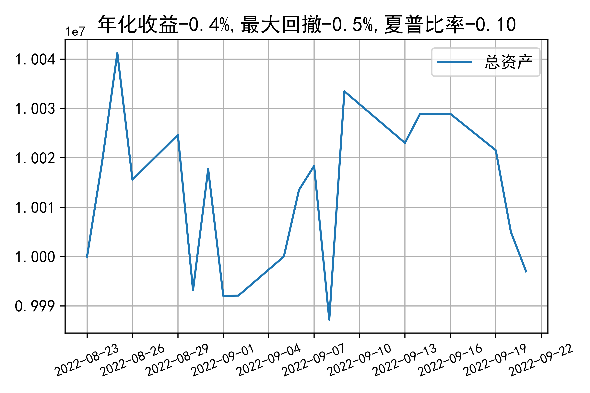

# 日级别vanna模拟交易2022-09-21概览
## 今日损益
|                    | 模拟账户损益统计   |
|:-------------------:|:-------------------:|
| 模拟账户名         | 1999_2-0070889     |
| 日期               | 2022-09-21         |
| 市值权益           | 9997025            |
| 今日损益(含手续费) | -8299 (-0.083%)    |
| 昨持损益           | -6867 (-0.069%)    |
| 日内损益           | -802 (-0.008%)     |
| 手续费             | 630 (0.006%)       |
| 总持仓             | 2885               |
| 净持仓             | -521               |
| 本月总计收益       | -34145             |
| 本月总计日内       | -3622              |
| 本月总计手续费     | 6234               |

## 持仓统计
**最终持仓统计**

|            | 2.65   | 2.7   | 2.75   | 2.8   |
|:-----------:|:-------:|:------:|:-------:|:------:|
| 202209call | -      | 207   | -      | -1324 |
| 202209put  | 975    | -     | -379   | -     |

**日内持仓变化**

|            | 2.65   | 2.7   | 2.75   | 2.8   |
|:-----------:|:-------:|:------:|:-------:|:------:|
| 202209call | -      | -     | -      | -121  |
| 202209put  | -210   | -     | -30    | -     |

## cashgreeks统计

**总体cashgreeks**
|        | \$Delta      | \$Gamma   | \$Vega       | \$Vanna        | \$Theta   | \$Charm   | \$Speed    | \$Vomma   |
|:-------:|:-------------:|:----------:|:-------------:|:---------------:|:----------:|:----------:|:-----------:|:----------:|
| 202209 | 254076       | 35668005  | 3667         | -774532        | -5637     | 362237333 | -420982961 | -692      |
| 总计   | 254076(2.5%) | 35668005  | 3667(0.037%) | -774532(-7.7%) | -5637     | 362237333 | -420982961 | -692      |

**日内cashgreeks**

|        | \$Delta   | \$Gamma   | \$Vega   | \$Vanna   | \$Theta   | \$Charm   | \$Speed   | \$Vomma   |
|:-------:|:----------:|:----------:|:---------:|:----------:|:----------:|:----------:|:----------:|:----------:|
| 202209 | 1903872   | -35703445 | -3786    | 10281     | 7239      | -4146655  | 68922409  | -131      |
| 总计   | 1903872   | -35703445 | -3786    | 10281     | 7239      | -4146655  | 68922409  | -131      |

## 总资产曲线图

