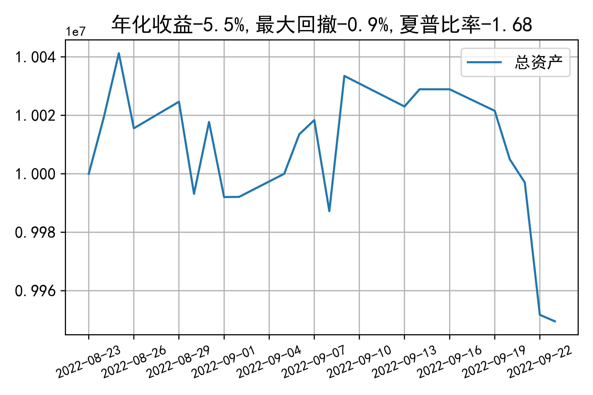

# 日级别vanna模拟交易2022-09-23概览
## 今日损益
|                    | 模拟账户损益统计   |
|:-------------------:|:-------------------:|
| 模拟账户名         | 1999_2-0070889     |
| 日期               | 2022-09-23         |
| 市值权益           | 9949533            |
| 今日损益(含手续费) | 375 (0.004%)       |
| 昨持损益           | 375 (0.004%)       |
| 日内损益           | 0 (0.0%)           |
| 手续费             | 0 (0.0%)           |
| 总持仓             | 4020               |
| 净持仓             | -866               |
| 本月总计收益       | -79038             |
| 本月总计日内       | -11891             |
| 本月总计手续费     | 9489               |

## 持仓统计
**最终持仓统计**

|            | 2.55   | 2.6   | 2.65   | 2.7   | 2.75   | 2.8   |
|:-----------:|:-------:|:------:|:-------:|:------:|:-------:|:------:|
| 202209call | -      | -     | -      | -     | -      | -1324 |
| 202209put  | -      | -     | 837    | -     | -379   | -     |
| 202210call | -      | 185   | -      | -     | -      | -555  |
| 202210put  | 555    | -     | -      | -     | -185   | -     |

**今日日内未交易**

## cashgreeks统计

**总体cashgreeks**
|        | \$Delta        | \$Gamma   | \$Vega       | \$Vanna        | \$Theta   | \$Charm   | \$Speed    | \$Vomma   |
|:-------:|:---------------:|:----------:|:-------------:|:---------------:|:----------:|:----------:|:-----------:|:----------:|
| 202209 | 533642         | 75221371  | 4664         | -520511        | -10439    | 430531511 | -632675390 | -526      |
| 202210 | 947119         | -6698761  | -740         | -433393        | -634      | 58845863  | -360786021 | -66       |
| 总计   | 1480761(14.8%) | 68522609  | 3924(0.039%) | -953905(-9.5%) | -11074    | 489377374 | 851212995  | -593      |

**日内cashgreeks**

|        | \$Delta   | \$Gamma   | \$Vega   | \$Vanna   | \$Theta   | \$Charm   | \$Speed   | \$Vomma   |
|:-------:|:----------:|:----------:|:---------:|:----------:|:----------:|:----------:|:----------:|:----------:|
| 202209 | 0         | 0         | 0        | 0         | 0         | 0         | 0         | 0         |
| 202210 | 0         | 0         | 0        | 0         | 0         | 0         | 0         | 0         |
| 总计   | 0         | 0         | 0        | 0         | 0         | 0         | 0         | 0         |

## 总资产曲线图

