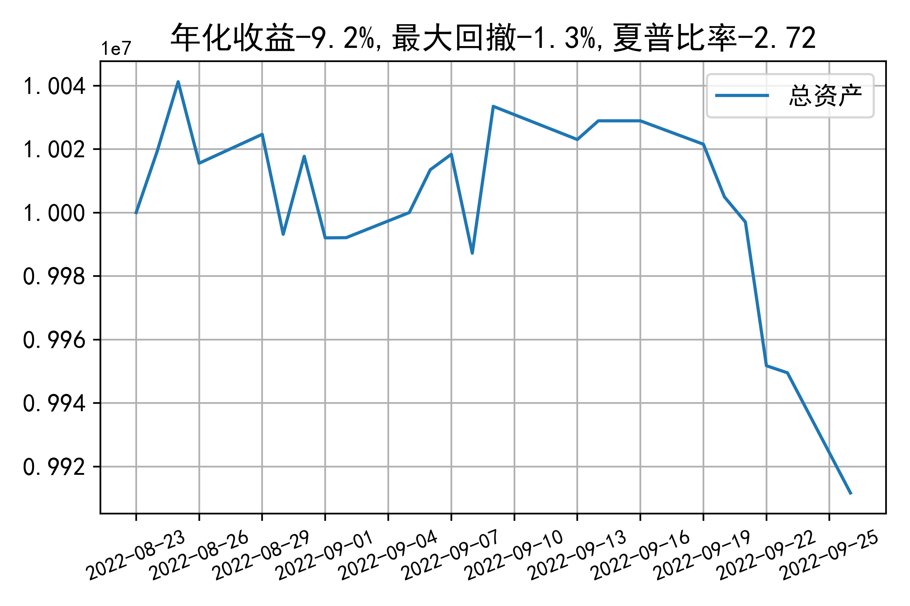

# 日级别vanna模拟交易2022-09-26概览
## 今日损益
|                    | 模拟账户损益统计   |
|:-------------------:|:-------------------:|
| 模拟账户名         | 1999_2-0070889     |
| 日期               | 2022-09-26         |
| 市值权益           | 9911671            |
| 今日损益(含手续费) | -39139 (-0.394%)   |
| 昨持损益           | -39139 (-0.391%)   |
| 日内损益           | 0 (0.0%)           |
| 手续费             | 0 (0.0%)           |
| 总持仓             | 4020               |
| 净持仓             | -866               |
| 本月总计收益       | -118177            |
| 本月总计日内       | -11891             |
| 本月总计手续费     | 9489               |

## 持仓统计
**最终持仓统计**

|            | 2.55   | 2.6   | 2.65   | 2.7   | 2.75   | 2.8   |
|:-----------:|:-------:|:------:|:-------:|:------:|:-------:|:------:|
| 202209call | -      | -     | -      | -     | -      | -1324 |
| 202209put  | -      | -     | 837    | -     | -379   | -     |
| 202210call | -      | 185   | -      | -     | -      | -555  |
| 202210put  | 555    | -     | -      | -     | -185   | -     |

**今日日内未交易**

## cashgreeks统计

**总体cashgreeks**
|        | \$Delta     | \$Gamma   | \$Vega       | \$Vanna        | \$Theta   | \$Charm   | \$Speed    | \$Vomma   |
|:-------:|:------------:|:----------:|:-------------:|:---------------:|:----------:|:----------:|:-----------:|:----------:|
| 202209 | -908146     | 161161951 | 6288         | -246292        | -21974    | 356878545 | -538743191 | -337      |
| 202210 | 978354      | 1230943   | 2035         | -414581        | -2167     | 61249299  | -372942474 | -235      |
| 总计   | 70207(0.7%) | 162392894 | 8323(0.083%) | -660874(-6.6%) | -24142    | 418127844 | -911685665 | -573      |

**日内cashgreeks**

|        | \$Delta   | \$Gamma   | \$Vega   | \$Vanna   | \$Theta   | \$Charm   | \$Speed   | \$Vomma   |
|:-------:|:----------:|:----------:|:---------:|:----------:|:----------:|:----------:|:----------:|:----------:|
| 202209 | 0         | 0         | 0        | 0         | 0         | 0         | 0         | 0         |
| 202210 | 0         | 0         | 0        | 0         | 0         | 0         | 0         | 0         |
| 总计   | 0         | 0         | 0        | 0         | 0         | 0         | 0         | 0         |

## 总资产曲线图

