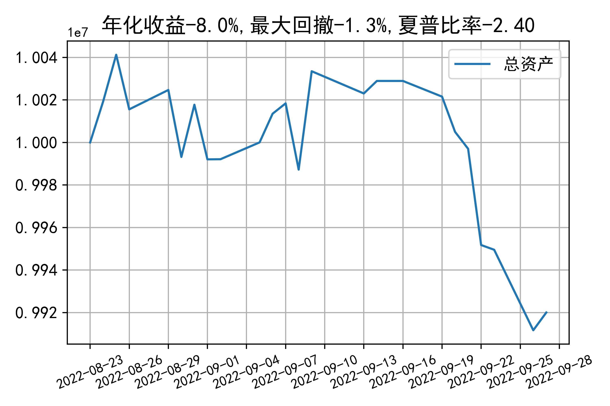

# 日级别vanna模拟交易2022-09-27概览
## 今日损益
|                    | 模拟账户损益统计   |
|:-------------------:|:-------------------:|
| 模拟账户名         | 1999_2-0070889     |
| 日期               | 2022-09-27         |
| 市值权益           | 9920030            |
| 今日损益(含手续费) | 8700 (0.088%)      |
| 昨持损益           | 13131 (0.131%)     |
| 日内损益           | -1872 (-0.019%)    |
| 手续费             | 2559 (0.026%)      |
| 总持仓             | 4448               |
| 净持仓             | -440               |
| 本月总计收益       | -109477            |
| 本月总计日内       | -13763             |
| 本月总计手续费     | 12048              |

## 持仓统计
**最终持仓统计**

|            | 2.55   | 2.6   | 2.65   | 2.7   | 2.75   | 2.8   |
|:-----------:|:-------:|:------:|:-------:|:------:|:-------:|:------:|
| 202209call | -      | -     | -      | -     | -      | -1252 |
| 202209put  | -      | -     | 837    | -     | -25    | -     |
| 202210call | -      | 291   | -      | -     | -321   | -555  |
| 202210put  | 876    | -     | -      | -106  | -185   | -     |

**日内持仓变化**

|            | 2.55   | 2.6   | 2.65   | 2.7   | 2.75   | 2.8   |
|:-----------:|:-------:|:------:|:-------:|:------:|:-------:|:------:|
| 202209call | -      | -     | -      | -     | -      | 72    |
| 202209put  | -      | -     | -      | -     | 354    | -     |
| 202210call | -      | 106   | -      | -     | -321   | -     |
| 202210put  | 321    | -     | -      | -106  | -      | -     |

## cashgreeks统计

**总体cashgreeks**
|        | \$Delta          | \$Gamma   | \$Vega         | \$Vanna          | \$Theta   | \$Charm    | \$Speed    | \$Vomma   |
|:-------:|:-----------------:|:----------:|:---------------:|:-----------------:|:----------:|:-----------:|:-----------:|:----------:|
| 202209 | -2353942         | 141567272 | 3323           | -373356          | -19269    | 837855814  | 855199740  | 131       |
| 202210 | 801353           | -23559595 | -5424          | -649235          | 1528      | 98978049   | -600137890 | 213       |
| 总计   | -1552588(-15.5%) | 118007677 | -2101(-0.021%) | -1022592(-10.2%) | -17741    | -907840543 | 255061849  | 345       |

**日内cashgreeks**

|        | \$Delta   | \$Gamma   | \$Vega   | \$Vanna   | \$Theta   | \$Charm    | \$Speed    | \$Vomma   |
|:-------:|:----------:|:----------:|:---------:|:----------:|:----------:|:-----------:|:-----------:|:----------:|
| 202209 | -9153209  | 21136636  | 354      | 67427     | -5262     | -173256758 | 51848053   | 79        |
| 202210 | -652671   | -12275722 | -3204    | -204683   | 1246      | 31460922   | -184222494 | 185       |
| 总计   | -9805881  | 8860913   | -2850    | -137255   | -4016     | -141795835 | -132374441 | 265       |

## 总资产曲线图

