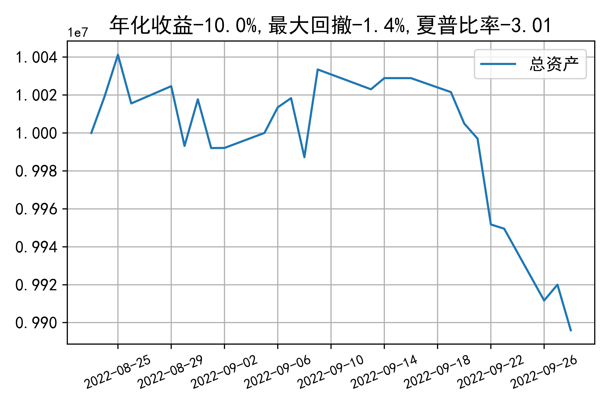

# 日级别vanna模拟交易2022-09-28概览
## 今日损益
|                    | 模拟账户损益统计   |
|:-------------------:|:-------------------:|
| 模拟账户名         | 1999_2-0070889     |
| 日期               | 2022-09-28         |
| 市值权益           | 9895981            |
| 今日损益(含手续费) | -20975 (-0.212%)   |
| 昨持损益           | -47001 (-0.47%)    |
| 日内损益           | 33541 (0.335%)     |
| 手续费             | 7515 (0.075%)      |
| 总持仓             | 3117               |
| 净持仓             | -1                 |
| 本月总计收益       | -130452            |
| 本月总计日内       | 19778              |
| 本月总计手续费     | 19563              |

## 持仓统计
**最终持仓统计**

|            | 2.55   |   2.6 | 2.65   | 2.7   |   2.75 | 2.8   |
|:-----------:|:-------:|:------:|:-------:|:------:|:-------:|:------:|
| 202210call | -      |   291 | 97     | -     |   -615 | -555  |
| 202210put  | 876    |   294 | -      | -106  |   -283 | -     |

**日内持仓变化**

|            | 2.55   | 2.6   | 2.65   | 2.7   | 2.75   | 2.8   |
|:-----------:|:-------:|:------:|:-------:|:------:|:-------:|:------:|
| 202209call | -      | -     | -      | -     | -      | 1252  |
| 202209put  | -      | -     | -837   | -     | 25     | -     |
| 202210call | -      | -     | 97     | -     | -294   | -     |
| 202210put  | -      | 294   | -      | -     | -98    | -     |

## cashgreeks统计

**总体cashgreeks**
|        | \$Delta       | \$Gamma   | \$Vega       | \$Vanna        | \$Theta   | \$Charm   | \$Speed    | \$Vomma   |
|:-------:|:--------------:|:----------:|:-------------:|:---------------:|:----------:|:----------:|:-----------:|:----------:|
| 202209 | 0             | 0         | 0            | 0              | 0         | 0         | 0          | 0         |
| 202210 | -51017        | 1556339   | 2818         | -817451        | -3281     | 135965729 | -815510198 | -345      |
| 总计   | -51017(-0.5%) | 1556339   | 2818(0.028%) | -817451(-8.2%) | -3281     | 135965729 | -815510198 | -345      |

**日内cashgreeks**

|        | \$Delta   | \$Gamma   | \$Vega   | \$Vanna   | \$Theta   | \$Charm    | \$Speed    | \$Vomma   |
|:-------:|:----------:|:----------:|:---------:|:----------:|:----------:|:-----------:|:-----------:|:----------:|
| 202209 | 6230878   | 9236047   | -3348    | -2669530  | -5882     | -329253121 | 500638446  | -856      |
| 202210 | -1209790  | 2701732   | 1346     | -175909   | -942      | 28674180   | -180505317 | -126      |
| 总计   | 5021087   | 11937780  | -2002    | -2845440  | -6825     | -300578941 | 320133128  | -983      |

## 总资产曲线图

