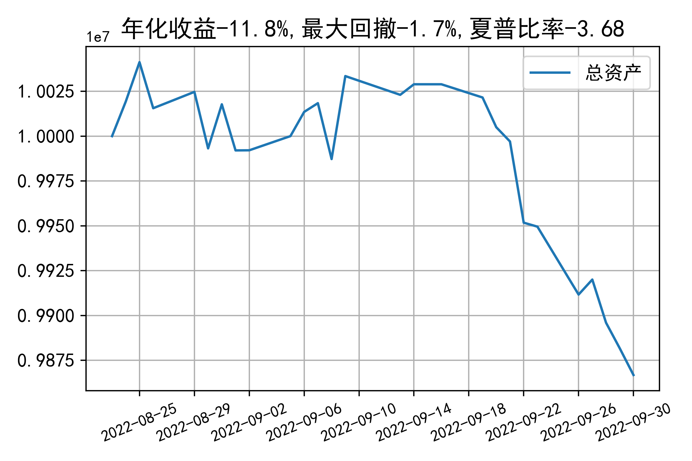

# 日级别vanna模拟交易2022-09-30概览
## 今日损益
|                    | 模拟账户损益统计   |
|:-------------------:|:-------------------:|
| 模拟账户名         | 1999_2-0070889     |
| 日期               | 2022-09-30         |
| 市值权益           | 9866818            |
| 今日损益(含手续费) | -14249 (-0.145%)   |
| 昨持损益           | -14424 (-0.144%)   |
| 日内损益           | 535 (0.005%)       |
| 手续费             | 360 (0.004%)       |
| 总持仓             | 2997               |
| 净持仓             | -121               |
| 本月总计收益       | -160128            |
| 本月总计日内       | 20313              |
| 本月总计手续费     | 19923              |

## 持仓统计
**最终持仓统计**

|            | 2.55   |   2.6 | 2.65   | 2.7   |   2.75 | 2.8   |
|:-----------:|:-------:|:------:|:-------:|:------:|:-------:|:------:|
| 202210call | -      |   195 | 97     | -     |   -615 | -555  |
| 202210put  | 852    |   294 | -      | -106  |   -283 | -     |

**日内持仓变化**

|            | 2.55   | 2.6   | 2.65   | 2.7   | 2.75   | 2.8   |
|:-----------:|:-------:|:------:|:-------:|:------:|:-------:|:------:|
| 202210call | -      | -96   | -      | -     | -      | -     |
| 202210put  | -24    | -     | -      | -     | -      | -     |

## cashgreeks统计

**总体cashgreeks**
|        | \$Delta     | \$Gamma   | \$Vega       | \$Vanna        | \$Theta   | \$Charm   | \$Speed   | \$Vomma   |
|:-------:|:------------:|:----------:|:-------------:|:---------------:|:----------:|:----------:|:----------:|:----------:|
| 202210 | 34422       | 2617556   | 1850         | -843437        | -1678     | 157197286 | 875432024 | -422      |
| 总计   | 34422(0.3%) | 2617556   | 1850(0.018%) | -843437(-8.4%) | -1678     | 157197286 | 875432024 | -422      |

**日内cashgreeks**

|        | \$Delta   | \$Gamma   | \$Vega   | \$Vanna   | \$Theta   | \$Charm   | \$Speed   | \$Vomma   |
|:-------:|:----------:|:----------:|:---------:|:----------:|:----------:|:----------:|:----------:|:----------:|
| 202210 | -1620160  | -8943565  | -2520    | 27139     | 1898      | -5004584  | 37758818  | -36       |
| 总计   | -1620160  | -8943565  | -2520    | 27139     | 1898      | -5004584  | 37758818  | -36       |

## 总资产曲线图

