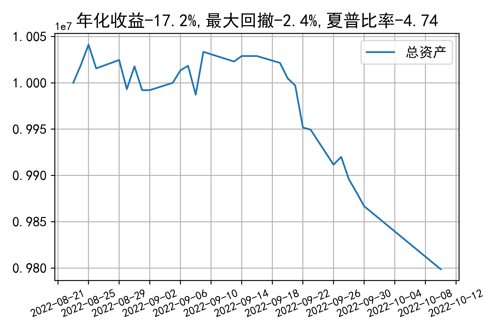

# 日级别vanna模拟交易2022-10-10概览
## 今日损益
|                    | 模拟账户损益统计   |
|:-------------------:|:-------------------:|
| 模拟账户名         | 1999_2-0070889     |
| 日期               | 2022-10-10         |
| 市值权益           | 9798773            |
| 今日损益(含手续费) | -68611 (-0.697%)   |
| 昨持损益           | -67977 (-0.68%)    |
| 日内损益           | -634 (-0.006%)     |
| 手续费             | 0 (0.0%)           |
| 总持仓             | 3323               |
| 净持仓             | -447               |
| 本月总计收益       | -68611             |
| 本月总计日内       | -634               |
| 本月总计手续费     | 0                  |

## 持仓统计
**最终持仓统计**

|            | 2.55   |   2.6 | 2.65   | 2.7   |   2.75 | 2.8   |
|:-----------:|:-------:|:------:|:-------:|:------:|:-------:|:------:|
| 202210call | -      |   195 | 97     | -     |   -615 | -755  |
| 202210put  | 852    |   294 | -      | -106  |   -409 | -     |

**日内持仓变化**

|            | 2.55   | 2.6   | 2.65   | 2.7   | 2.75   | 2.8   |
|:-----------:|:-------:|:------:|:-------:|:------:|:-------:|:------:|
| 202210call | -      | -     | -      | -     | -      | -200  |
| 202210put  | -      | -     | -      | -     | -126   | -     |

## cashgreeks统计

**总体cashgreeks**
|        | \$Delta      | \$Gamma   | \$Vega        | \$Vanna        | \$Theta   | \$Charm   | \$Speed   | \$Vomma   |
|:-------:|:-------------:|:----------:|:--------------:|:---------------:|:----------:|:----------:|:----------:|:----------:|
| 202210 | 574307       | 68772033  | 15743         | -576018        | -11068    | 118807676 | 888033823 | -1397     |
| 总计   | 574307(5.7%) | 68772033  | 15743(0.157%) | -576018(-5.8%) | -11068    | 118807676 | 888033823 | -1397     |

**日内cashgreeks**

|        | \$Delta   | \$Gamma   | \$Vega   | \$Vanna   | \$Theta   | \$Charm   | \$Speed    | \$Vomma   |
|:-------:|:----------:|:----------:|:---------:|:----------:|:----------:|:----------:|:-----------:|:----------:|
| 202210 | 2684295   | -9201998  | -2334    | -80374    | 2132      | 16915312  | -116094658 | -265      |
| 总计   | 2684295   | -9201998  | -2334    | -80374    | 2132      | 16915312  | -116094658 | -265      |

## 总资产曲线图

