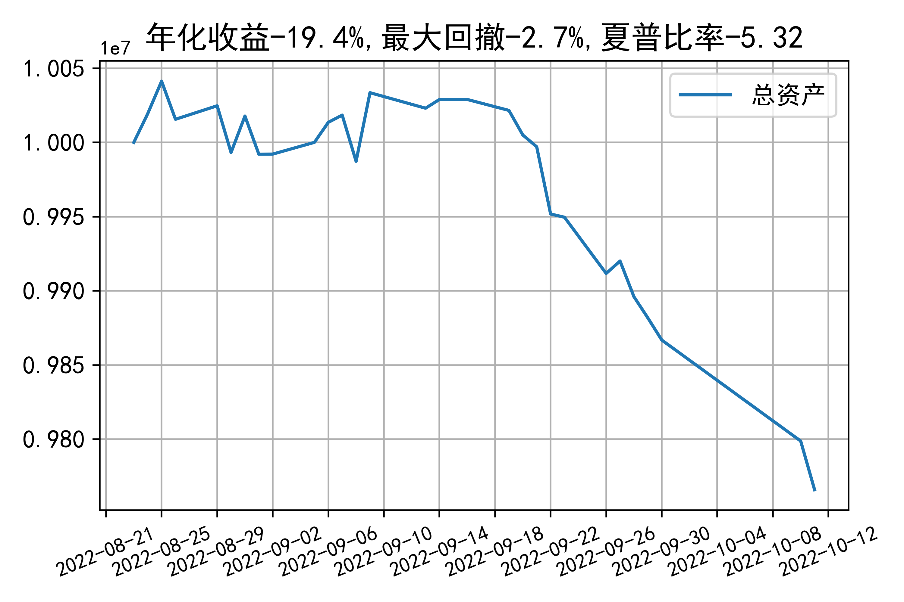

# 日级别vanna模拟交易2022-10-11概览
## 今日损益
|                    | 模拟账户损益统计   |
|:-------------------:|:-------------------:|
| 模拟账户名         | 1999_2-0070889     |
| 日期               | 2022-10-11         |
| 市值权益           | 9686018            |
| 今日损益(含手续费) | -45422 (-0.468%)   |
| 昨持损益           | -37071 (-0.371%)   |
| 日内损益           | -4844 (-0.048%)    |
| 手续费             | 3507 (0.035%)      |
| 总持仓             | 4975               |
| 净持仓             | -701               |
| 本月总计收益       | -114033            |
| 本月总计日内       | -5478              |
| 本月总计手续费     | 3507               |

## 持仓统计
**最终持仓统计**

|            | 2.5   |   2.55 |   2.6 |   2.65 | 2.7   |   2.75 | 2.8   |
|:-----------:|:------:|:-------:|:------:|:-------:|:------:|:-------:|:------:|
| 202210call | -     |    172 |   195 |   -685 | -     |   -615 | -755  |
| 202210put  | 624   |    852 |   294 |   -268 | -106  |   -409 | -     |

**日内持仓变化**

|            | 2.5   | 2.55   | 2.6   |   2.65 | 2.7   | 2.75   | 2.8   |
|:-----------:|:------:|:-------:|:------:|:-------:|:------:|:-------:|:------:|
| 202210call | -     | 76     | -     |   -804 | -     | -      | -     |
| 202210put  | 330   | -      | -     |   -268 | -     | -      | -     |

## cashgreeks统计

**总体cashgreeks**
|        | \$Delta        | \$Gamma   | \$Vega        | \$Vanna          | \$Theta   | \$Charm   | \$Speed   | \$Vomma   |
|:-------:|:---------------:|:----------:|:--------------:|:-----------------:|:----------:|:----------:|:----------:|:----------:|
| 202210 | -191761        | 54678868  | 11747         | -1057302         | -7613     | 229157577 | -65376312 | -1362     |
| 总计   | -191761(-1.9%) | 54678868  | 11747(0.117%) | -1057302(-10.6%) | -7613     | 229157577 | -65376312 | -1362     |

**日内cashgreeks**

|        | \$Delta   | \$Gamma   | \$Vega   | \$Vanna   | \$Theta   | \$Charm   | \$Speed    | \$Vomma   |
|:-------:|:----------:|:----------:|:---------:|:----------:|:----------:|:----------:|:-----------:|:----------:|
| 202210 | -986855   | -59696534 | -12420   | -435839   | 10342     | 89571729  | -761495409 | -255      |
| 总计   | -986855   | -59696534 | -12420   | -435839   | 10342     | 89571729  | -761495409 | -255      |

## 总资产曲线图

