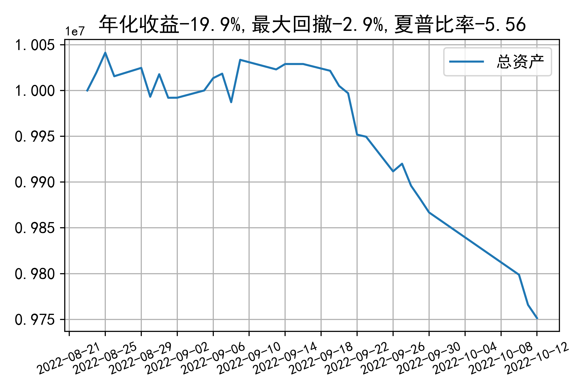

# 日级别vanna模拟交易2022-10-12概览
## 今日损益
|                    | 模拟账户损益统计   |
|:-------------------:|:-------------------:|
| 模拟账户名         | 1999_2-0070889     |
| 日期               | 2022-10-12         |
| 市值权益           | 9751442            |
| 今日损益(含手续费) | -12171 (-0.125%)   |
| 昨持损益           | -12171 (-0.122%)   |
| 日内损益           | 0 (0.0%)           |
| 手续费             | 0 (0.0%)           |
| 总持仓             | 4585               |
| 净持仓             | -1091              |
| 本月总计收益       | -126204            |
| 本月总计日内       | -5478              |
| 本月总计手续费     | 3507               |

## 持仓统计
**最终持仓统计**

|            | 2.5   |   2.55 |   2.6 |   2.65 | 2.7   |   2.75 | 2.8   |
|:-----------:|:------:|:-------:|:------:|:-------:|:------:|:-------:|:------:|
| 202210call | -     |     76 |   195 |   -685 | -     |   -615 | -755  |
| 202210put  | 330   |    852 |   294 |   -268 | -106  |   -409 | -     |

**今日日内未交易**

## cashgreeks统计

**总体cashgreeks**
|        | \$Delta      | \$Gamma   | \$Vega         | \$Vanna          | \$Theta   | \$Charm   | \$Speed   | \$Vomma   |
|:-------:|:-------------:|:----------:|:---------------:|:-----------------:|:----------:|:----------:|:----------:|:----------:|
| 202210 | 436715       | 5588213   | -2074          | -1038796         | 4416      | 253958440 | -84622894 | -1128     |
| 总计   | 436715(4.4%) | 5588213   | -2074(-0.021%) | -1038796(-10.4%) | 4416      | 253958440 | -84622894 | -1128     |

**日内cashgreeks**

|        | \$Delta   | \$Gamma   | \$Vega   | \$Vanna   | \$Theta   | \$Charm   | \$Speed   | \$Vomma   |
|:-------:|:----------:|:----------:|:---------:|:----------:|:----------:|:----------:|:----------:|:----------:|
| 202210 | 0         | 0         | 0        | 0         | 0         | 0         | 0         | 0         |
| 总计   | 0         | 0         | 0        | 0         | 0         | 0         | 0         | 0         |

## 总资产曲线图

