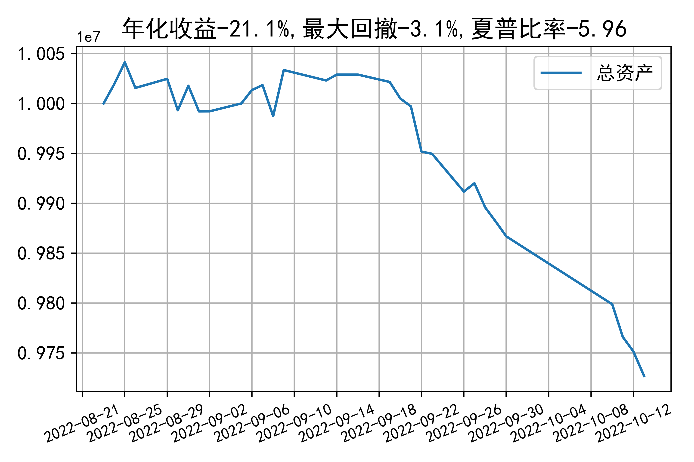

# 日级别vanna模拟交易2022-10-13概览
## 今日损益
|                    | 模拟账户损益统计   |
|:-------------------:|:-------------------:|
| 模拟账户名         | 1999_2-0070889     |
| 日期               | 2022-10-13         |
| 市值权益           | 9727043            |
| 今日损益(含手续费) | -22969 (-0.236%)   |
| 昨持损益           | -23184 (-0.232%)   |
| 日内损益           | 665 (0.007%)       |
| 手续费             | 450 (0.004%)       |
| 总持仓             | 4435               |
| 净持仓             | -1241              |
| 本月总计收益       | -149173            |
| 本月总计日内       | -4813              |
| 本月总计手续费     | 3957               |

## 持仓统计
**最终持仓统计**

|            | 2.5   |   2.55 |   2.6 |   2.65 | 2.7   |   2.75 | 2.8   |
|:-----------:|:------:|:-------:|:------:|:-------:|:------:|:-------:|:------:|
| 202210call | -     |     21 |   195 |   -685 | -     |   -615 | -755  |
| 202210put  | 330   |    757 |   294 |   -268 | -106  |   -409 | -     |

**日内持仓变化**

|            | 2.5   |   2.55 | 2.6   | 2.65   | 2.7   | 2.75   | 2.8   |
|:-----------:|:------:|:-------:|:------:|:-------:|:------:|:-------:|:------:|
| 202210call | -     |    -55 | -     | -      | -     | -      | -     |
| 202210put  | -     |    -95 | -     | -      | -     | -      | -     |

## cashgreeks统计

**总体cashgreeks**
|        | \$Delta       | \$Gamma   | \$Vega       | \$Vanna        | \$Theta   | \$Charm   | \$Speed   | \$Vomma   |
|:-------:|:--------------:|:----------:|:-------------:|:---------------:|:----------:|:----------:|:----------:|:----------:|
| 202210 | -77106        | 39595126  | 5457         | -748078        | -4199     | 213928024 | 342715721 | -1408     |
| 总计   | -77106(-0.8%) | 39595126  | 5457(0.055%) | -748078(-7.5%) | -4199     | 213928024 | 342715721 | -1408     |

**日内cashgreeks**

|        | \$Delta   | \$Gamma   | \$Vega   | \$Vanna   | \$Theta   | \$Charm   | \$Speed   | \$Vomma   |
|:-------:|:----------:|:----------:|:---------:|:----------:|:----------:|:----------:|:----------:|:----------:|
| 202210 | 167037    | -15764952 | -2850    | 14890     | 3079      | -3840437  | 44709508  | -6        |
| 总计   | 167037    | -15764952 | -2850    | 14890     | 3079      | -3840437  | 44709508  | -6        |

## 总资产曲线图

