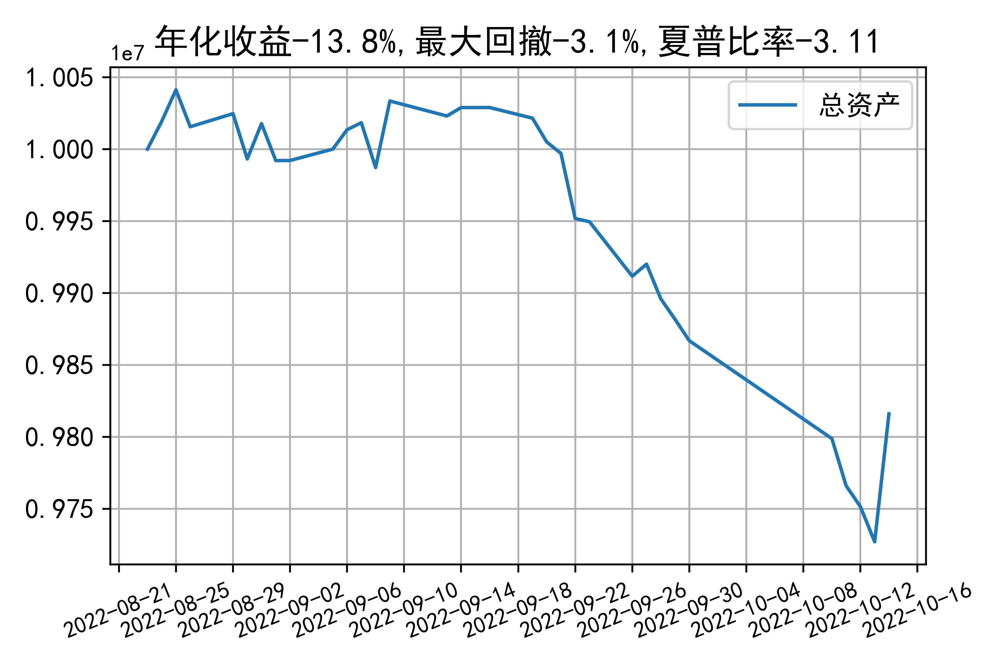

# 日级别vanna模拟交易2022-10-14概览
## 今日损益
|                    | 模拟账户损益统计   |
|:-------------------:|:-------------------:|
| 模拟账户名         | 1999_2-0070889     |
| 日期               | 2022-10-14         |
| 市值权益           | 9816010            |
| 今日损益(含手续费) | 130383 (1.352%)    |
| 昨持损益           | 141413 (1.414%)    |
| 日内损益           | 2275 (0.023%)      |
| 手续费             | 13305 (0.133%)     |
| 总持仓             | 0                  |
| 净持仓             | 0                  |
| 本月总计收益       | -18790             |
| 本月总计日内       | -2538              |
| 本月总计手续费     | 17262              |

## 持仓统计
**今日最终未持仓**

**日内持仓变化**

|            | 2.5   |   2.55 |   2.6 |   2.65 | 2.7   |   2.75 | 2.8   |
|:-----------:|:------:|:-------:|:------:|:-------:|:------:|:-------:|:------:|
| 202210call | -     |    -21 |  -195 |    855 | -     |    615 | 865   |
| 202210put  | -330  |   -757 |  -294 |    400 | 106   |    409 | -     |

## cashgreeks统计

**总体cashgreeks**
|        | \$Delta   | \$Gamma   | \$Vega   | \$Vanna   | \$Theta   | \$Charm   | \$Speed   | \$Vomma   |
|:-------:|:----------:|:----------:|:---------:|:----------:|:----------:|:----------:|:----------:|:----------:|
| 202210 | 0         | 0         | 0        | 0         | 0         | 0         | 0         | 0         |
| 总计   | 0(0.0%)   | 0         | 0(0.0%)  | 0(0.0%)   | 0         | 0         | 0         | 0         |

**日内cashgreeks**

|        | \$Delta   | \$Gamma   | \$Vega   | \$Vanna   | \$Theta   | \$Charm    | \$Speed   | \$Vomma   |
|:-------:|:----------:|:----------:|:---------:|:----------:|:----------:|:-----------:|:----------:|:----------:|
| 202210 | -1250804  | 109406461 | 17398    | 1195608   | -17891    | -334544047 | 909040941 | 762       |
| 总计   | -1250804  | 109406461 | 17398    | 1195608   | -17891    | -334544047 | 909040941 | 762       |

## 总资产曲线图

