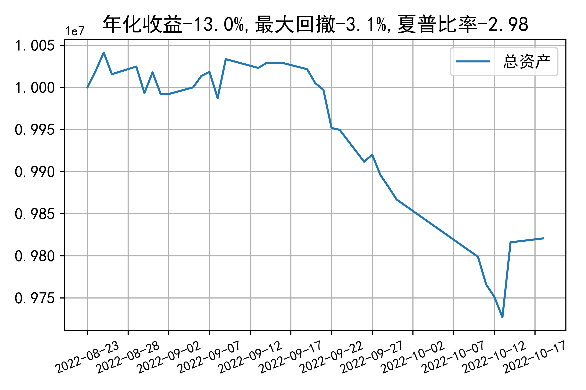

# 日级别vanna模拟交易2022-10-18概览
## 今日损益
|                    | 模拟账户损益统计   |
|:-------------------:|:-------------------:|
| 模拟账户名         | 1999_2-0070889     |
| 日期               | 2022-10-18         |
| 市值权益           | 9820664            |
| 今日损益(含手续费) | 4654 (0.048%)      |
| 昨持损益           | 0 (0.0%)           |
| 日内损益           | 6442 (0.064%)      |
| 手续费             | 1788 (0.018%)      |
| 总持仓             | 1188               |
| 净持仓             | 4                  |
| 本月总计收益       | -14136             |
| 本月总计日内       | 3904               |
| 本月总计手续费     | 19050              |

## 持仓统计
**最终持仓统计**

|            | 2.55   |   2.6 | 2.65   | 2.7   |
|:-----------:|:-------:|:------:|:-------:|:------:|
| 202210call | -      |  -148 | -      | 447   |
| 202210put  | -291   |  -153 | 149    | -     |

**日内持仓变化**

|            | 2.55   |   2.6 | 2.65   | 2.7   |
|:-----------:|:-------:|:------:|:-------:|:------:|
| 202210call | -      |  -148 | -      | 447   |
| 202210put  | -291   |  -153 | 149    | -     |

## cashgreeks统计

**总体cashgreeks**
|        | \$Delta        | \$Gamma   | \$Vega         | \$Vanna      | \$Theta   | \$Charm    | \$Speed    | \$Vomma   |
|:-------:|:---------------:|:----------:|:---------------:|:-------------:|:----------:|:-----------:|:-----------:|:----------:|
| 202210 | -486401        | -25372304 | -2355          | 335028       | 3184      | -115494035 | -589042957 | 192       |
| 总计   | -486401(-4.9%) | -25372304 | -2355(-0.024%) | 335028(3.4%) | 3184      | -115494035 | -589042957 | 192       |

**日内cashgreeks**

|        | \$Delta   | \$Gamma   | \$Vega   | \$Vanna   | \$Theta   | \$Charm    | \$Speed    | \$Vomma   |
|:-------:|:----------:|:----------:|:---------:|:----------:|:----------:|:-----------:|:-----------:|:----------:|
| 202210 | -486401   | -25372304 | -2355    | 335028    | 3184      | -115494035 | -589042957 | 192       |
| 总计   | -486401   | -25372304 | -2355    | 335028    | 3184      | -115494035 | -589042957 | 192       |

## 总资产曲线图

