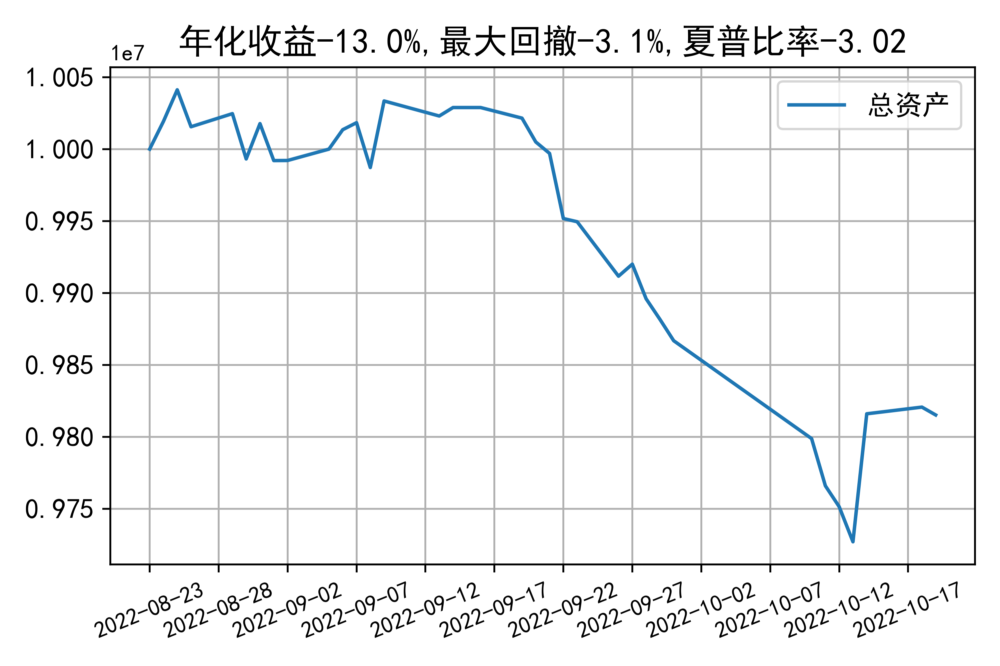

# 日级别vanna模拟交易2022-10-19概览
## 今日损益
|                    | 模拟账户损益统计   |
|:-------------------:|:-------------------:|
| 模拟账户名         | 1999_2-0070889     |
| 日期               | 2022-10-19         |
| 市值权益           | 9815193            |
| 今日损益(含手续费) | -6062 (-0.062%)    |
| 昨持损益           | -2004 (-0.02%)     |
| 日内损益           | -494 (-0.005%)     |
| 手续费             | 3564 (0.036%)      |
| 总持仓             | 0                  |
| 净持仓             | 0                  |
| 本月总计收益       | -20198             |
| 本月总计日内       | 3410               |
| 本月总计手续费     | 22614              |

## 持仓统计
**今日最终未持仓**

**日内持仓变化**

|            | 2.55   |   2.6 | 2.65   | 2.7   |
|:-----------:|:-------:|:------:|:-------:|:------:|
| 202210call | -      |   148 | -      | -447  |
| 202210put  | 291    |   153 | -149   | -     |

## cashgreeks统计

**总体cashgreeks**
|        | \$Delta   | \$Gamma   | \$Vega   | \$Vanna   | \$Theta   | \$Charm   | \$Speed   | \$Vomma   |
|:-------:|:----------:|:----------:|:---------:|:----------:|:----------:|:----------:|:----------:|:----------:|
| 202210 | 0         | 0         | 0        | 0         | 0         | 0         | 0         | 0         |
| 总计   | 0(0.0%)   | 0         | 0(0.0%)  | 0(0.0%)   | 0         | 0         | 0         | 0         |

**日内cashgreeks**

|        | \$Delta   | \$Gamma   | \$Vega   | \$Vanna   | \$Theta   | \$Charm   | \$Speed    | \$Vomma   |
|:-------:|:----------:|:----------:|:---------:|:----------:|:----------:|:----------:|:-----------:|:----------:|
| 202210 | -899839   | 61605085  | 5146     | -57456    | -8124     | 36810165  | -195403951 | -200      |
| 总计   | -899839   | 61605085  | 5146     | -57456    | -8124     | 36810165  | -195403951 | -200      |

## 总资产曲线图

