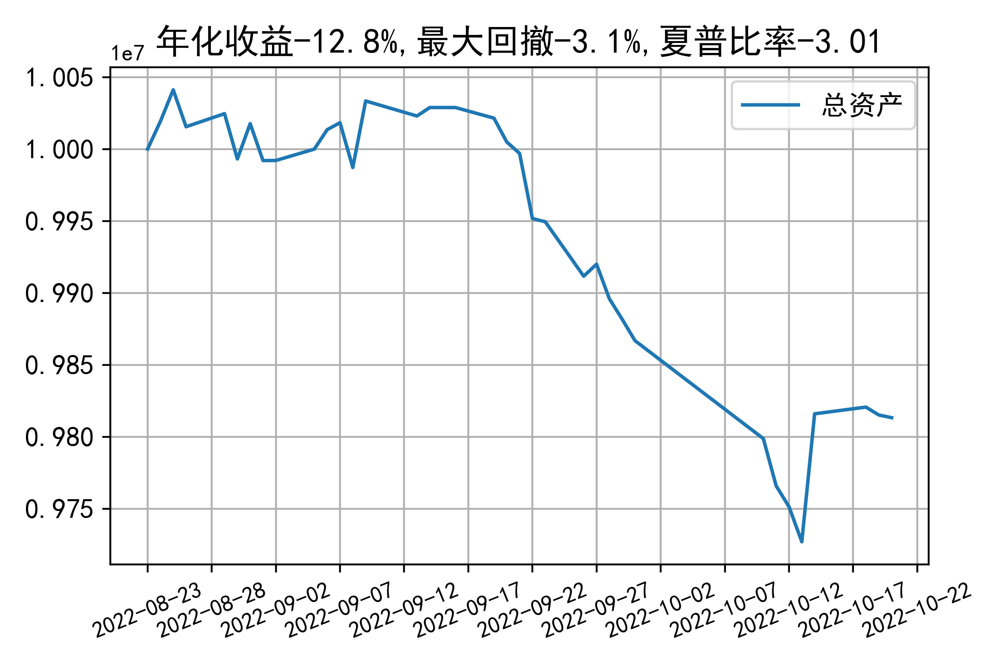

# 日级别vanna模拟交易2022-10-20概览
## 今日损益
|                    | 模拟账户损益统计   |
|:-------------------:|:-------------------:|
| 模拟账户名         | 1999_2-0070889     |
| 日期               | 2022-10-20         |
| 市值权益           | 9813307            |
| 今日损益(含手续费) | -1885 (-0.019%)    |
| 昨持损益           | 0 (0.0%)           |
| 日内损益           | 4319 (0.043%)      |
| 手续费             | 6204 (0.062%)      |
| 总持仓             | 4142               |
| 净持仓             | -6                 |
| 本月总计收益       | -22083             |
| 本月总计日内       | 7729               |
| 本月总计手续费     | 28818              |

## 持仓统计
**最终持仓统计**

|            | 2.5   | 2.55   | 2.6   |
|:-----------:|:------:|:-------:|:------:|
| 202210call | 475   | -      | -1425 |
| 202210put  | 1425  | -      | -475  |
| 202211call | -     | -174   | -     |
| 202211put  | -     | 168    | -     |

**日内持仓变化**

|            | 2.5   | 2.55   | 2.6   |
|:-----------:|:------:|:-------:|:------:|
| 202210call | 475   | -      | -1425 |
| 202210put  | 1425  | -      | -475  |
| 202211call | -     | -174   | -     |
| 202211put  | -     | 168    | -     |

## cashgreeks统计

**总体cashgreeks**
|        | \$Delta          | \$Gamma   | \$Vega       | \$Vanna          | \$Theta   | \$Charm   | \$Speed   | \$Vomma   |
|:-------:|:-----------------:|:----------:|:-------------:|:-----------------:|:----------:|:----------:|:----------:|:----------:|
| 202210 | 2606539          | 16156675  | 1900         | -1094069         | -5021     | 661664445 | 560090587 | -164      |
| 202211 | -4360786         | -410738   | -192         | -111             | 74        | 10401     | 230798    | 0         |
| 总计   | -1754247(-17.5%) | 15745936  | 1708(0.017%) | -1094181(-10.9%) | -4946     | 661674846 | 560321386 | -164      |

**日内cashgreeks**

|        | \$Delta   | \$Gamma   | \$Vega   | \$Vanna   | \$Theta   | \$Charm   | \$Speed   | \$Vomma   |
|:-------:|:----------:|:----------:|:---------:|:----------:|:----------:|:----------:|:----------:|:----------:|
| 202210 | 2606539   | 16156675  | 1900     | -1094069  | -5021     | 661664445 | 560090587 | -164      |
| 202211 | -4360786  | -410738   | -192     | -111      | 74        | 10401     | 230798    | 0         |
| 总计   | -1754247  | 15745936  | 1708     | -1094181  | -4946     | 661674846 | 560321386 | -164      |

## 总资产曲线图

