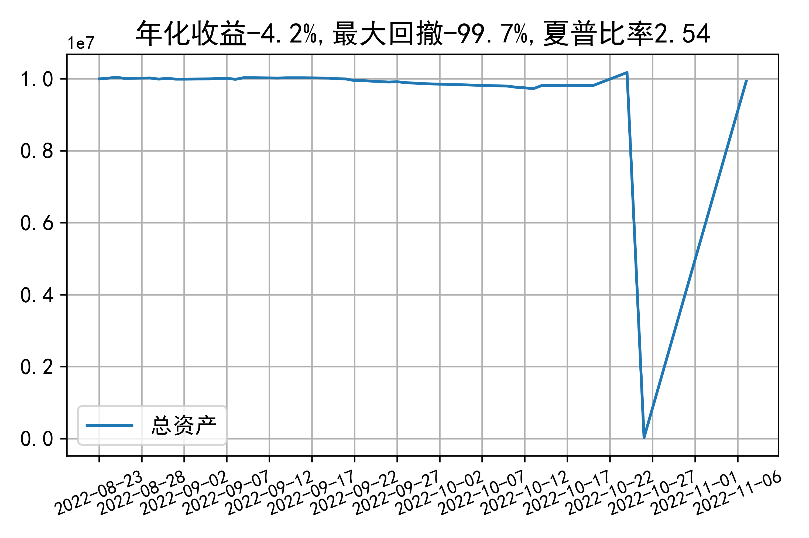

# 日级别vanna模拟交易2022-11-07概览
## 今日损益
|                    | 模拟账户损益统计    |
|:-------------------:|:--------------------:|
| 模拟账户名         | simtest1            |
| 日期               | 2022-11-07          |
| 市值权益           | 9932762             |
| 今日损益(含手续费) | 4386 (0.044%)       |
| 昨持损益           | 0 (0.0%)            |
| 日内损益           | 4648 (0.046%)       |
| 手续费             | 262.399999 (0.003%) |
| 总持仓             | 2621                |
| 净持仓             | 3                   |
| 本月总计收益       | 4386                |
| 本月总计日内       | 4648                |
| 本月总计手续费     | 262                 |

## 持仓统计
**最终持仓统计**

|            |   2.45 |   2.5 | 2.55   | 2.6   |
|:-----------:|:-------:|:------:|:-------:|:------:|
| 202211call |   -307 |   -81 | -      | 921   |
| 202211put  |   -921 |    84 | 307    | -     |

**日内持仓变化**

|            |   2.45 |   2.5 | 2.55   | 2.6   |
|:-----------:|:-------:|:------:|:-------:|:------:|
| 202211call |   -307 |   -84 | -      | 921   |
| 202211put  |   -921 |    84 | 307    | -     |

## cashgreeks统计

**总体cashgreeks**
|        | \$Delta     | \$Gamma   | \$Vega     | \$Vanna      | \$Theta   | \$Charm    | \$Speed   | \$Vomma   |
|:-------:|:------------:|:----------:|:-----------:|:-------------:|:----------:|:-----------:|:----------:|:----------:|
| 202211 | 40131       | -1400115  | 66         | 553561       | -796      | -119010289 | 881147277 | 24        |
| 总计   | 40131(0.4%) | -1400115  | 66(0.001%) | 553561(5.5%) | -796      | -119010289 | 881147277 | 24        |

**日内cashgreeks**

|        | \$Delta   | \$Gamma   | \$Vega   | \$Vanna   | \$Theta   | \$Charm    | \$Speed   | \$Vomma   |
|:-------:|:----------:|:----------:|:---------:|:----------:|:----------:|:-----------:|:----------:|:----------:|
| 202211 | -2437     | -1657530  | 0        | 553727    | -739      | -119044812 | 881631545 | 23        |
| 总计   | -2437     | -1657530  | 0        | 553727    | -739      | -119044812 | 881631545 | 23        |

## 总资产曲线图

