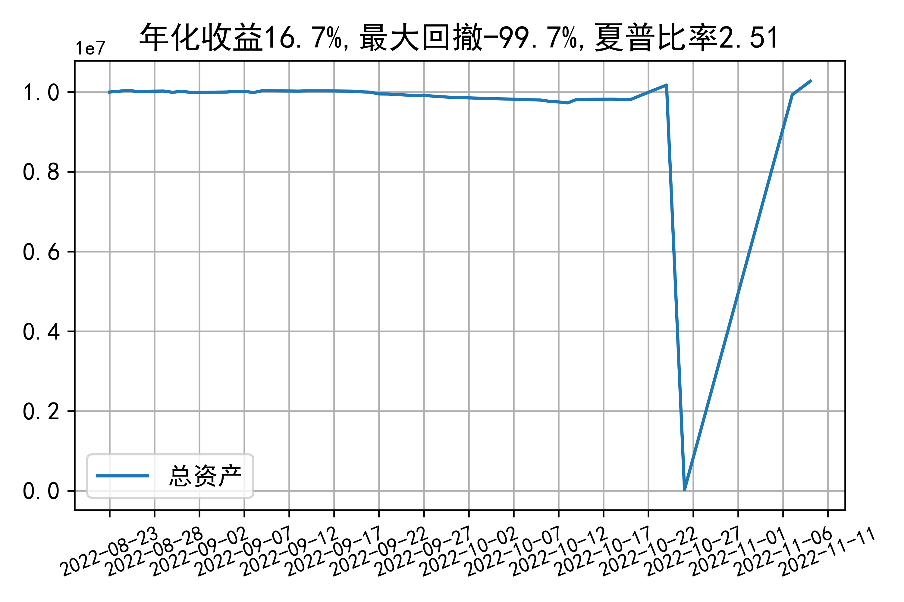

# 日级别vanna模拟交易2022-11-09概览
## 今日损益
|                    | 模拟账户损益统计   |
|:-------------------:|:-------------------:|
| 模拟账户名         | simtest1           |
| 日期               | 2022-11-09         |
| 市值权益           | 10271948           |
| 今日损益(含手续费) | 24590 (0.241%)     |
| 昨持损益           | 29416 (0.294%)     |
| 日内损益           | -4753 (-0.048%)    |
| 手续费             | 72.6 (0.001%)      |
| 总持仓             | 1898               |
| 净持仓             | 388                |
| 本月总计收益       | 28976              |
| 本月总计日内       | -105               |
| 本月总计手续费     | 334                |

## 持仓统计
**最终持仓统计**

|            |   2.45 |   2.5 | 2.55   | 2.6   |
|:-----------:|:-------:|:------:|:-------:|:------:|
| 202211call |    -97 |   -37 | -      | 865   |
| 202211put  |   -621 |    18 | 260    | -     |

**日内持仓变化**

|            |   2.45 |   2.5 | 2.55   | 2.6   |
|:-----------:|:-------:|:------:|:-------:|:------:|
| 202211call |    210 |    47 | -      | -56   |
| 202211put  |    300 |   -66 | -47    | -     |

## cashgreeks统计

**总体cashgreeks**
|        | \$Delta        | \$Gamma   | \$Vega      | \$Vanna      | \$Theta   | \$Charm    | \$Speed   | \$Vomma   |
|:-------:|:---------------:|:----------:|:------------:|:-------------:|:----------:|:-----------:|:----------:|:----------:|
| 202211 | 2209217        | -3752098  | 778         | 403181       | -2353     | -105542179 | 765896345 | 513       |
| 总计   | 2209217(22.1%) | -3752098  | 778(0.008%) | 403181(4.0%) | -2353     | -105542179 | 765896345 | 513       |

**日内cashgreeks**

|        | \$Delta   | \$Gamma   | \$Vega   | \$Vanna   | \$Theta   | \$Charm   | \$Speed    | \$Vomma   |
|:-------:|:----------:|:----------:|:---------:|:----------:|:----------:|:----------:|:-----------:|:----------:|
| 202211 | 2572578   | 39413532  | 7839     | -98572    | -7692     | 24378115  | -229680513 | -2        |
| 总计   | 2572578   | 39413532  | 7839     | -98572    | -7692     | 24378115  | -229680513 | -2        |

## 总资产曲线图

