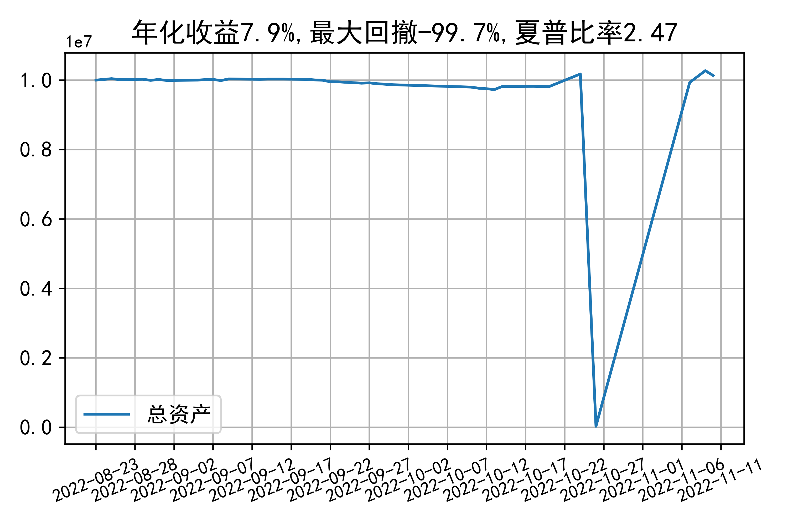

# 日级别vanna模拟交易2022-11-10概览
## 今日损益
|                    | 模拟账户损益统计   |
|:-------------------:|:-------------------:|
| 模拟账户名         | simtest1           |
| 日期               | 2022-11-10         |
| 市值权益           | 10132057           |
| 今日损益(含手续费) | -1 (-0.0%)         |
| 昨持损益           | -1 (-0.0%)         |
| 日内损益           | 0 (0.0%)           |
| 手续费             | 0 (0.0%)           |
| 总持仓             | 1898               |
| 净持仓             | 388                |
| 本月总计收益       | 28975              |
| 本月总计日内       | -105               |
| 本月总计手续费     | 334                |

## 持仓统计
**最终持仓统计**

|            |   2.45 |   2.5 | 2.55   | 2.6   |
|:-----------:|:-------:|:------:|:-------:|:------:|
| 202211call |    -97 |   -37 | -      | 865   |
| 202211put  |   -621 |    18 | 260    | -     |

**今日日内未交易**

## cashgreeks统计

**总体cashgreeks**
|        | \$Delta        | \$Gamma   | \$Vega       | \$Vanna      | \$Theta   | \$Charm    | \$Speed   | \$Vomma   |
|:-------:|:---------------:|:----------:|:-------------:|:-------------:|:----------:|:-----------:|:----------:|:----------:|
| 202211 | 1927016        | -2199395  | 1255         | 410975       | -3162     | -121749228 | 834159684 | 442       |
| 总计   | 1927016(19.3%) | -2199395  | 1255(0.013%) | 410975(4.1%) | -3162     | -121749228 | 834159684 | 442       |

**日内cashgreeks**

|        | \$Delta   | \$Gamma   | \$Vega   | \$Vanna   | \$Theta   | \$Charm   | \$Speed   | \$Vomma   |
|:-------:|:----------:|:----------:|:---------:|:----------:|:----------:|:----------:|:----------:|:----------:|
| 202211 | 0         | 0         | 0        | 0         | 0         | 0         | 0         | 0         |
| 总计   | 0         | 0         | 0        | 0         | 0         | 0         | 0         | 0         |

## 总资产曲线图

