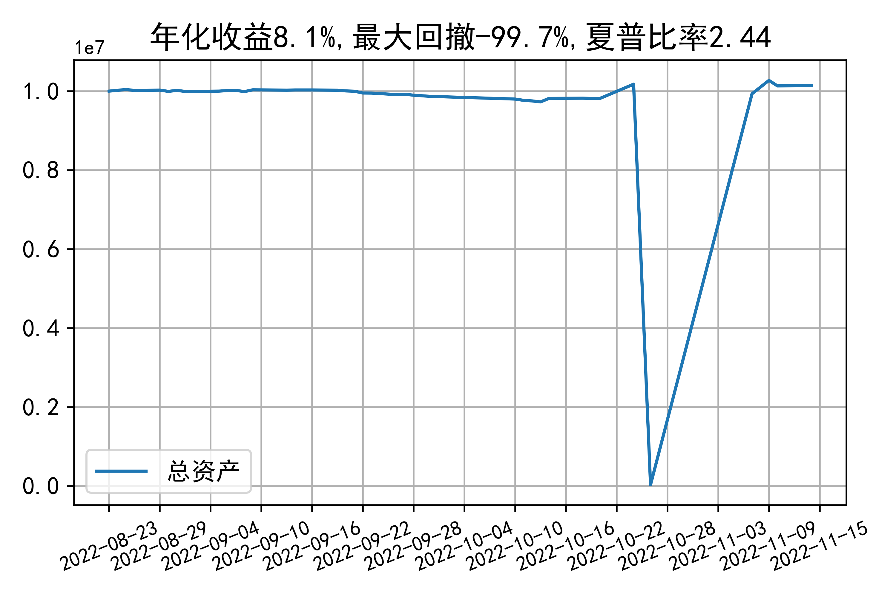

# 日级别vanna模拟交易2022-11-14概览
## 今日损益
|                    | 模拟账户损益统计   |
|:-------------------:|:-------------------:|
| 模拟账户名         | simtest1           |
| 日期               | 2022-11-14         |
| 市值权益           | 10137674           |
| 今日损益(含手续费) | -2095 (-0.021%)    |
| 昨持损益           | 45886 (0.459%)     |
| 日内损益           | -46025 (-0.46%)    |
| 手续费             | 1956 (0.02%)       |
| 总持仓             | 1898               |
| 净持仓             | 1304               |
| 本月总计收益       | 26880              |
| 本月总计日内       | -46130             |
| 本月总计手续费     | 2290               |

## 持仓统计
**最终持仓统计**

|            |   2.45 |   2.5 | 2.55   | 2.6   |
|:-----------:|:-------:|:------:|:-------:|:------:|
| 202211call |     97 |   -37 | -      | 865   |
| 202211put  |    621 |    18 | -260   | -     |

**日内持仓变化**

|            |   2.45 | 2.5   | 2.55   | 2.6   |
|:-----------:|:-------:|:------:|:-------:|:------:|
| 202211call |     97 | -     | -      | -     |
| 202211put  |    621 | -     | -260   | -     |

## cashgreeks统计

**总体cashgreeks**
|        | \$Delta          | \$Gamma   | \$Vega        | \$Vanna       | \$Theta   | \$Charm   | \$Speed    | \$Vomma   |
|:-------:|:-----------------:|:----------:|:--------------:|:--------------:|:----------:|:----------:|:-----------:|:----------:|
| 202211 | 11429892         | 95599329  | 15782         | -27340        | -24855    | 16447415  | -108647403 | 390       |
| 总计   | 11429892(114.3%) | 95599329  | 15782(0.158%) | -27340(-0.3%) | -24855    | 16447415  | -108647403 | 390       |

**日内cashgreeks**

|        | \$Delta   | \$Gamma   | \$Vega   | \$Vanna   | \$Theta   | \$Charm   | \$Speed    | \$Vomma   |
|:-------:|:----------:|:----------:|:---------:|:----------:|:----------:|:----------:|:-----------:|:----------:|
| 202211 | 3181534   | 4866273   | 1324     | -140590   | -2706     | 58479029  | -332854195 | 354       |
| 总计   | 3181534   | 4866273   | 1324     | -140590   | -2706     | 58479029  | -332854195 | 354       |

## 总资产曲线图

